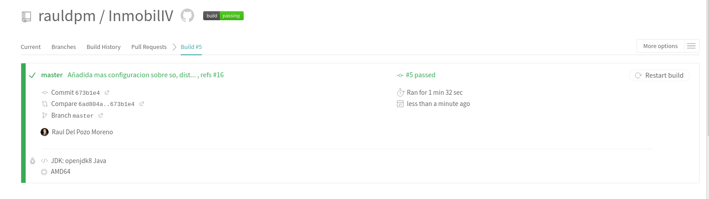
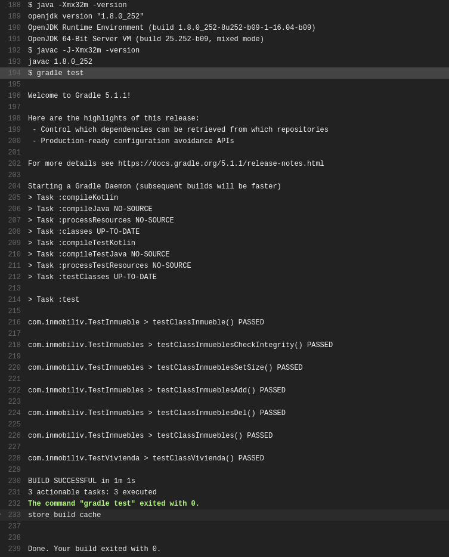
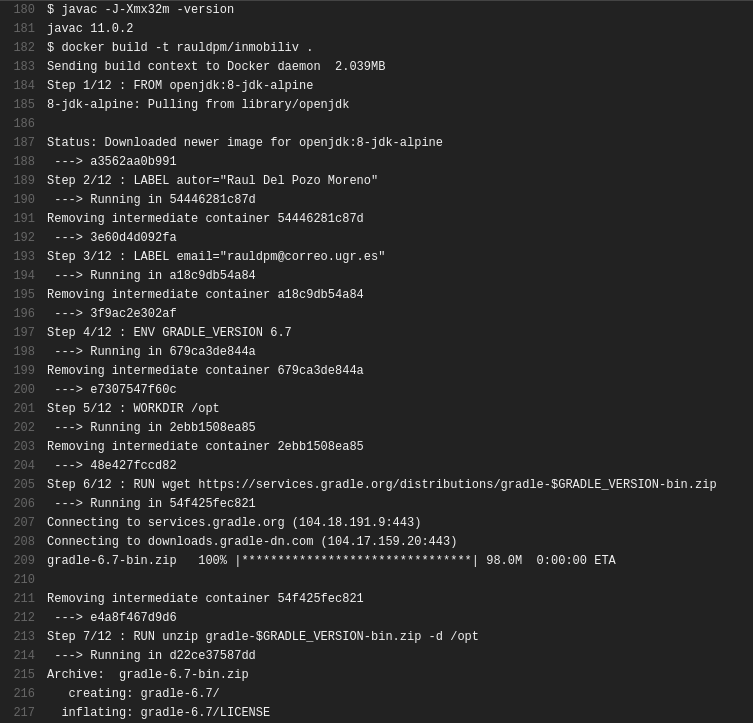
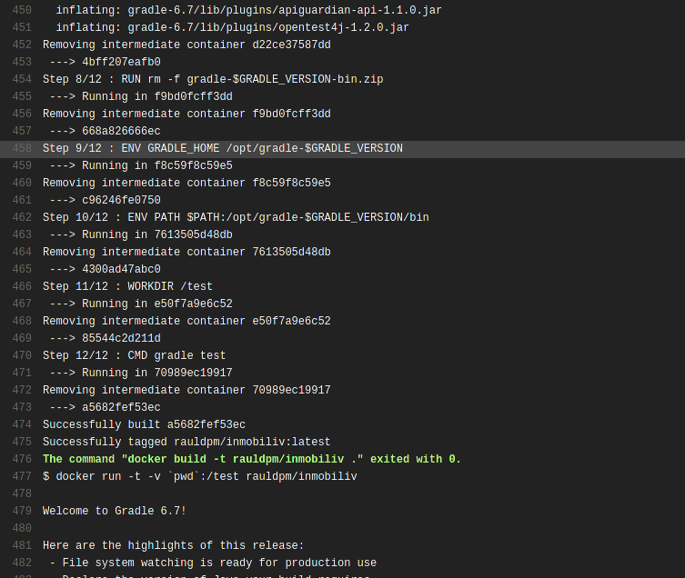

## Hito4 R1 - Integración continua funcionando y correcta justificación de la misma. 

Para esta rubrica se ha utilizado Travis CI, para ello, hay que identificarse con la cuenta de GitHub en https://travis-ci.com/.

Una vez dentro habrá que enlazar el repositorio, cosa que se realiza desde GitHub, desde GitHub Apps:

Una vez hecho esto, cuando se realize un push al repositorio de GitHub, se lanzará el test en Travis.

Para que esto suceda, hay que añadir un fichero llamado ".travis.yml", el cual contendrá la configuración necesaria para que se ejecute Travis.

En este [enlace](https://github.com/rauldpm/Ejercicios-IV-20-21/blob/main/docs/tema2.md) se puede observar los pasos realizados.

**En dicho enlace, el repositorio a usar se establece en Travis CI debido a que es la manera en la que se hacia en Travis-CI.org, pero debido a que posteriormente se esta realizando una migración a Travis-CI.com, el repositorio se establece desde GitHub Apps en GitHub como se puede ver en la imagen superior.**

He realizado dos versiones, la primera usando directamente el gestor de tareas y la segunda reutilizando el contenedor de docker.

La primera version se puede ver en el siguiente [enlace](https://github.com/rauldpm/Ejercicios-IV-20-21/blob/main/docs/files/tema2/.travis.yml).

En este [enlace](https://travis-ci.com/github/rauldpm/InmobilIV/builds/197199265) se puede observar el correcto funcionamiento de Travis, pasando los test unitarios.

La configuración travis para el uso de Docker se puede ver a continuación.

---
## Hito 4 R4 - Aprovechamiento del contenedor de Docker generado en el hito anterior en alguno de los sistemas de CI, especialmente si hay un cambio o adaptación del mismo. 

Este fichero corresponde con el fichero actual en uso, el cual se puede consultar [aquí](../.travis.yml).

Para este caso, solamente habría que indicar que se va a usar Docker mediante el tag "services:" y realizar las ordenes correspondientes de docker.

También he indicado la arquitectura, el sistema operativo, la distribución, y el lenguaje (aunque no se use), por que me parece algo necesario. Sobre todo el lenguaje, ya que si no se indica, Travis establece el lenguaje como Ruby (es lenguaje por defecto) y eso podría confundir, ya que el lenguaje usado es Kotlin (que como no aparece en la lista de lenguajes soportados de Travis se indica Java).

Aquí hay dos opciones para trabajar con Docker:

1. Descargar la imagen desde DockerHub
2. Realizar un build de la imagen

De estas dos opciones me he decantado por la segunda, ya que actualmente al realizar un push al repositorio, la imagen se construye en DockerHub, pero tiene el problema de que (en mi caso) he visto que Travis realiza el pull de la imagen de DockerHub antes de que termine el build de DockerHub, por lo que utiliza la imagen anterior.

Como no he encontrado una solución a esta condición de carrera, he preferido realizar un build de la imagen dentro de Travis y asi de paso aprovechar para que compruebe que la imagen se construya correctamente.

En este [enlace](https://travis-ci.com/github/rauldpm/InmobilIV/jobs/429060887) se puede observar el correcto funcionamiento de la integración continua utilizando Docker.

En la siguiente imagen se puede ver la ejecución del comando:

> docker build -t rauldpm/inmobiliv .

Y su finalización correcta:

También se puede ver el inicio de la ejecución del contenedor en la linea 477, con su finalizacion correcta de los test unitarios:

Como se puede ver, pasa correctamente:

