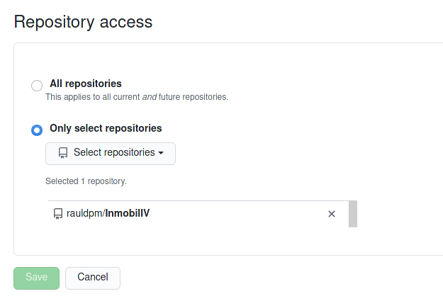
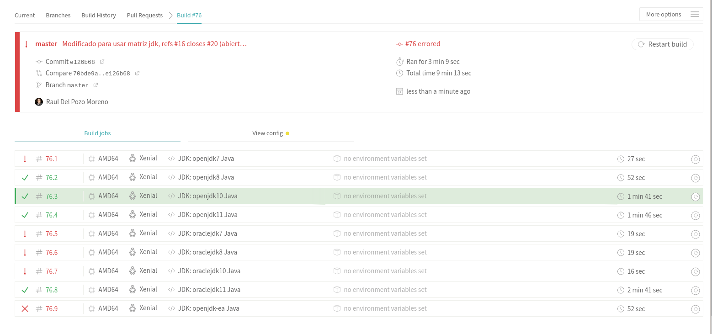
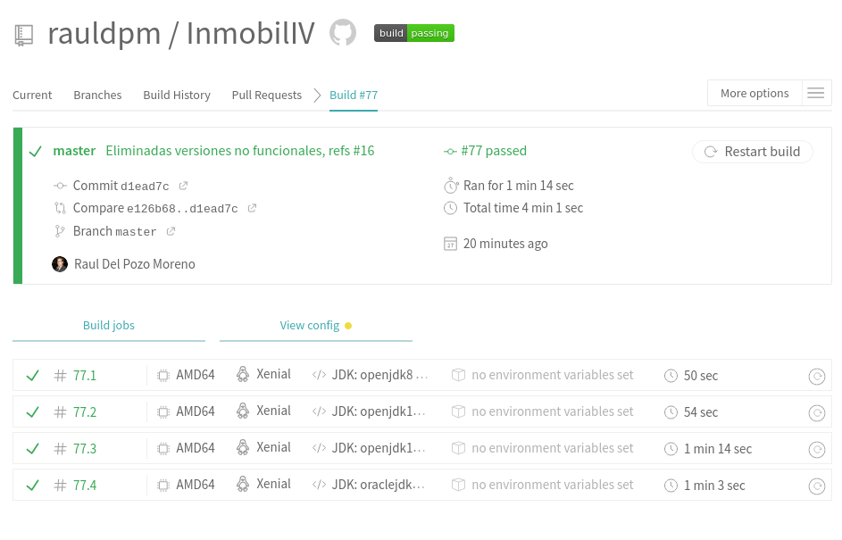
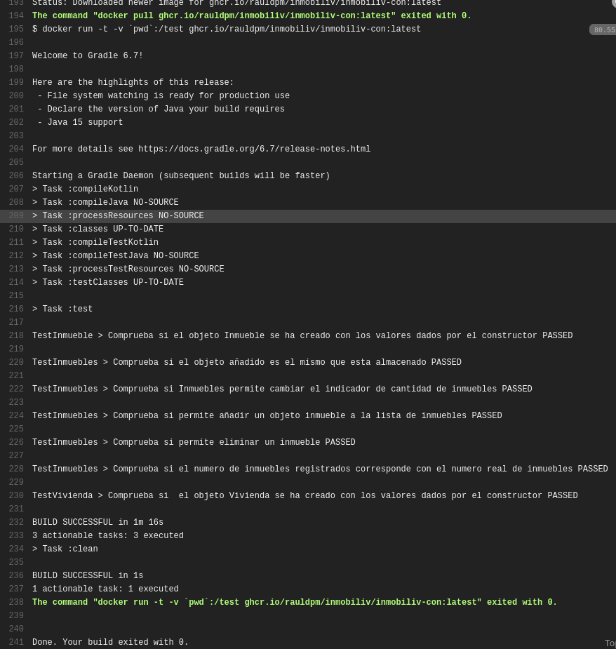
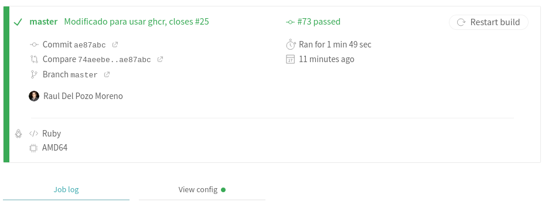

## Hito4 R1 - Integración continua funcionando y correcta justificación de la misma. 

Para esta rubrica se ha utilizado Travis CI, para ello, hay que identificarse con la cuenta de GitHub en https://travis-ci.com/.

Una vez dentro habrá que enlazar el repositorio, cosa que se realiza desde GitHub, desde GitHub Apps:

Una vez hecho esto, cuando se realize un push al repositorio de GitHub, se lanzará el test en Travis.

Para que esto suceda, hay que añadir un fichero llamado ".travis.yml", el cual contendrá la configuración necesaria para que se ejecute Travis.

En este [enlace](https://github.com/rauldpm/Ejercicios-IV-20-21/blob/main/docs/tema2.md) se puede observar los pasos realizados.

**En dicho enlace, el repositorio a usar se establece en Travis CI debido a que es la manera en la que se hacia en Travis-CI.org, pero debido a que posteriormente se esta realizando una migración a Travis-CI.com, el repositorio se establece desde GitHub Apps en GitHub como se puede ver en la imagen superior.**

He realizado dos versiones, la primera usando directamente el gestor de tareas y la segunda reutilizando el contenedor de docker.

La primera version se puede ver en el siguiente [enlace](https://github.com/rauldpm/InmobilIV/blob/d1ead7cb9543cca3a1be5f91283726ffd8b459f6/.travis.yml).

Adicionalmente, se puede observar que se han establecido varias versiones de jdk.

Se puede ver que algunas versiones indicadas en la primera version, no son soportadas ya que fallan:

En este [enlace](https://travis-ci.com/github/rauldpm/InmobilIV/builds/199342845) se puede observar el correcto funcionamiento de Travis, pasando los test unitarios para las versiones jdk indicadas.

La configuración travis para el uso de Docker se puede ver en el siguiente punto.

---
## Hito 4 R4 - Aprovechamiento del contenedor de Docker generado en el hito anterior en alguno de los sistemas de CI, especialmente si hay un cambio o adaptación del mismo. 

Este fichero corresponde con el fichero actual en uso, el cual se puede consultar [aquí](../.travis.yml).

Para este caso, solamente habría que indicar que se va a usar Docker mediante el tag "services:" y realizar las ordenes correspondientes de docker.

Para el uso de la imagen del contenedor he reutilizado la imagen subida a GHCR.

En este [enlace](https://travis-ci.com/github/rauldpm/InmobilIV/builds/199334735) se puede observar el correcto funcionamiento de la integración continua utilizando Docker.

En la siguiente imagen se puede ver la ejecución del comando:

Como se puede ver, pasa correctamente:

