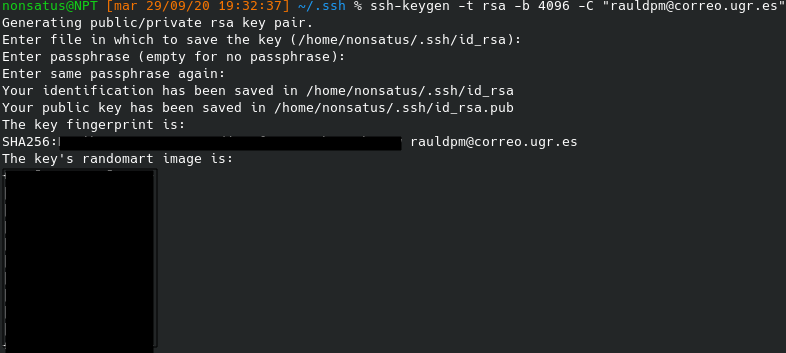
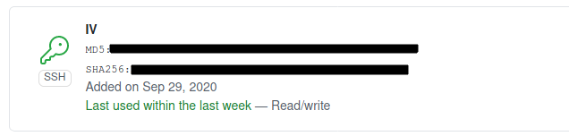
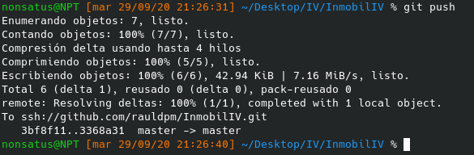

## Creacion de claves y subida a GitHub

Mediante esta configuracion se conseguirá que git no pida el correo ni la contraseña cada vez que se quiera gestionar el repositorio, para ello, primero hay que crear una clave en la maquina local mediante el comando:

> ssh-keygen -t rsa -b 4096 -C "email"

Esto generara un par de claves pubica/privada, donde hay que indicar el nombre del fichero que albergara las claves (por defecto: id_rsa) y una contraseña.

En GitHub hay que almacenar la clave publica creada, para ello, hay que ir a "Settings" > "SSH and GPG keys", donde se pulsara sobre "New SSH key" y se pondra un titulo y la clave que se encuentra en el fichero "id_rsa.pub" (o como se haya llamado).

Una vez hecho esto hay que establecer que el repositorio remoto sea mediante ssh, para ello, se elimina el repositorio mediante:

> git remote rm origin
>
> git remote add origin ssh://git@github.com/usuario/repo.git

Asi, al realizar un push no pedirá el email ni la contraseña:

## Configuracion del perfil de GitHub

Para configurar el perfil simplemente hay que ir a "Settings" y en la pestaña "Profile" rellenar los datos que se pidan.

