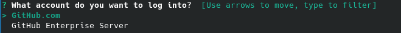
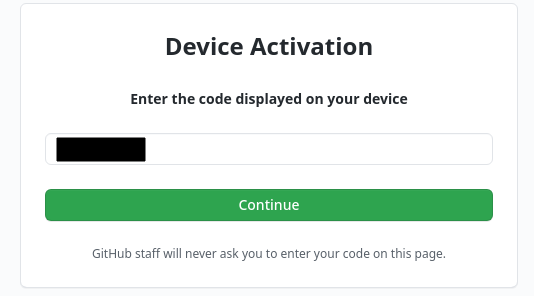
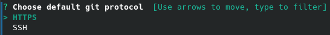

## Creación de claves y subida a GitHub 

Mediante esta configuración se conseguirá que git no pida el correo ni la contraseña cada vez que se quiera gestionar el repositorio, para ello, primero hay que crear una clave en la máquina local mediante el comando:

> ssh-keygen -t rsa -b 4096 -C "email"

Esto generará un par de claves pública/privada, donde hay que indicar el nombre del fichero que albergará las claves (por defecto: id_rsa) y una contraseña.

En GitHub hay que almacenar la clave publica creada, para ello, hay que ir a "Settings" --> "SSH and GPG keys", donde se pulsará sobre "New SSH key" y se pondrá un título y la clave que se encuentra en el fichero "id_rsa.pub" (o como se haya llamado).

Una vez hecho esto hay que establecer que el repositorio remoto sea mediante ssh, para ello, se elimina el repositorio mediante:

> git remote rm origin
>
> git remote add origin ssh://git@github.com/usuario/repo.git

Así, al realizar un push no pedirá el email ni la contraseña:

## Configuración del perfil de GitHub 

Para configurar el perfil simplemente hay que ir a "Settings" y en la pestaña "Profile" rellenar los datos que se pidan.

## Configuración del cliente de GitHub 

Mediante este cliente se podrá disponer de un comando para interactuar con GitHub sin necesidad de la web.

Por ejemplo, permitirá crear *issues* con el comando:

> gh issue create --title "titulo" --body "cuerpo"

Para ello, primero he tenido que instalar el paquete *gh-cli* para ArchLinux desde su repositorio AUR.

Una vez instalado hay que autentificarse mediante el comando

> gh auth login

Nos preguntará el tipo de cuenta, que se tiene, elijo la normal (no empresarial): GitHub.com

Acto seguido preguntará como se quiere identificar, si mediante un token de autenticación o mediante la web, esta última opción proporcionará un código de un solo uso y abrirá una ventana del navegador.

En el navegador, habrá que autenticarse con la cuenta de GitHub y acto seguido introducir dicho código de un solo uso.

Si lo acepta, tendremos que autorizar a GitHub CLI como una aplicación de confianza.

Cuando lo hayamos aceptado, nos preguntará el tipo de protocolo de conexión a usar, elijo SSH.

Y finalmente se habrá conectado.

