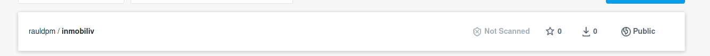
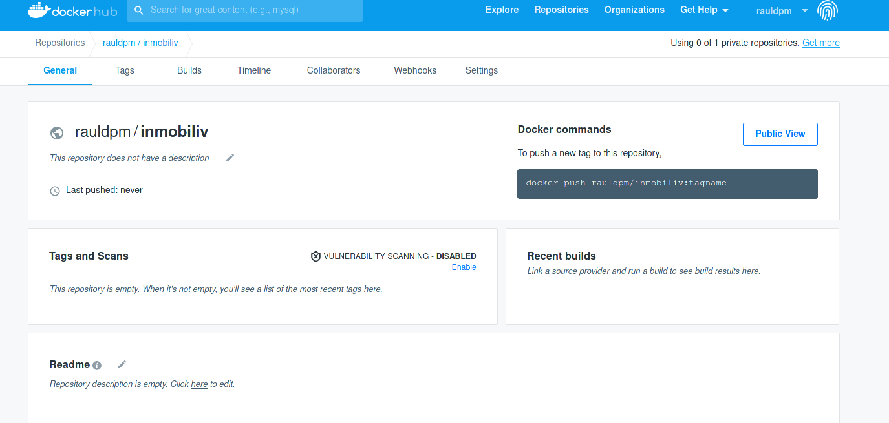
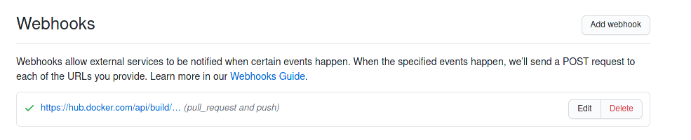

## Despliegue en DockerHub

En este fichero se va a explicar los pasos seguidos y la configuración realizada para realizar el despliegue del contenedor en DockerHub y la relación con GitHub.

### Indice

1. [Creación repositorio DockerHub](#id1)
2. [Configuración](#id2)

---
### 1. Creación repositorio DockerHub

Después de crearme una cuenta con el mismo "nick" que en GitHub en DockerHub, he creado un repositorio.

Para ello, en la pestaña "Repositories", he pulsado "Create Repository", donde he tenido solamente que indicar el nombre de mi repositorio.

Una vez creado se puede observar que ha aparecido el repositorio en la lista:

Al pinchar sobre el repositorio, se puede ver un repositorio inicial vacío y que no tiene nada sincronizado con el repositorio de GitHub:

---
### 2. Configuración

Una vez creado el repositorio hay que realizar la configuración para que cuando se realice un "git push" al repositorio de GitHub, se actualice en DockerHub.

El primer paso es enlazar la cuenta de GitHub con DockerHub, para ello, en la pestaña "Build", hay que pulsar sobre el cuadro que pone: "Link to GitHub":

Esto llevara a otra ventana donde hay que indicar el repositorio deseado:

Que quedaría con los siguientes campos:

En esa misma pagina, pero mas abajo, se puede observar una serie de campos donde se indica la localización del archivo Dockerfile en el repositorio.

Una vez terminado de configurarlo, las construcciones automáticas estarán habilitadas como se puede ver en la siguiente imagen, donde indica el estado del ultimo "build realizado", en este caso, marca "success" pero se puede ver debajo que no hay builds recientes.

Una vez hecho esto, en GitHub, se habrá añadido automáticamente el siguiente "Webhook", que como se puede ver, contiene un enlace hacia "hub.docker". 

De esta forma cuando se realice un "push" hacia GitHub, lo enlazará con DockerHub.

Así, al realizar un push en DockerHub se verá que el estado de builds automáticos, pasará al estado "PENDING".

Unos momentos después, dicho estado cambiará a "IN PROGRESS", que quiere decir que esta realizando el build.

Una vez que termine, si no ha habido errores, el estado cambiará a "SUCCESS".

En este punto, al mirar el repositorio de DockerHub, se podrá observar que ya contiene algunos datos mas que antes no estaban, como el README de GitHub.

  