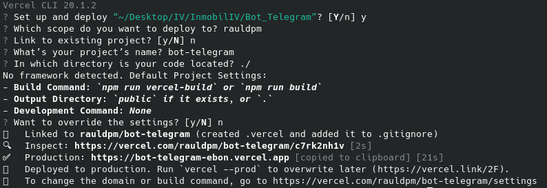
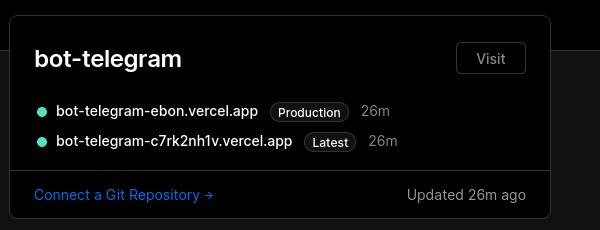
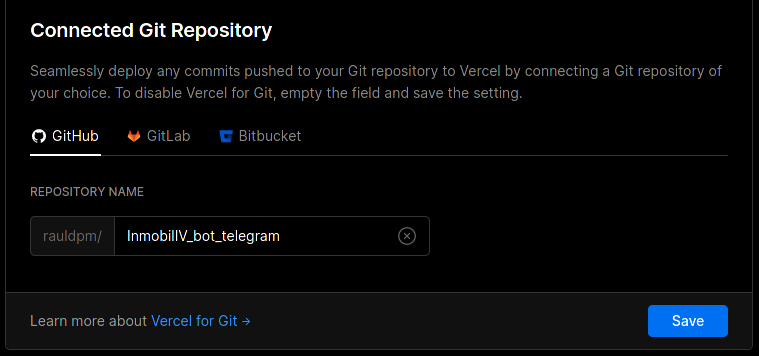
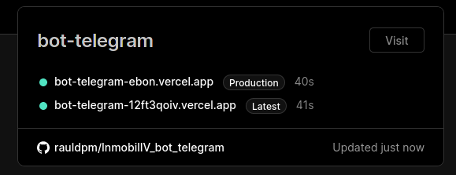
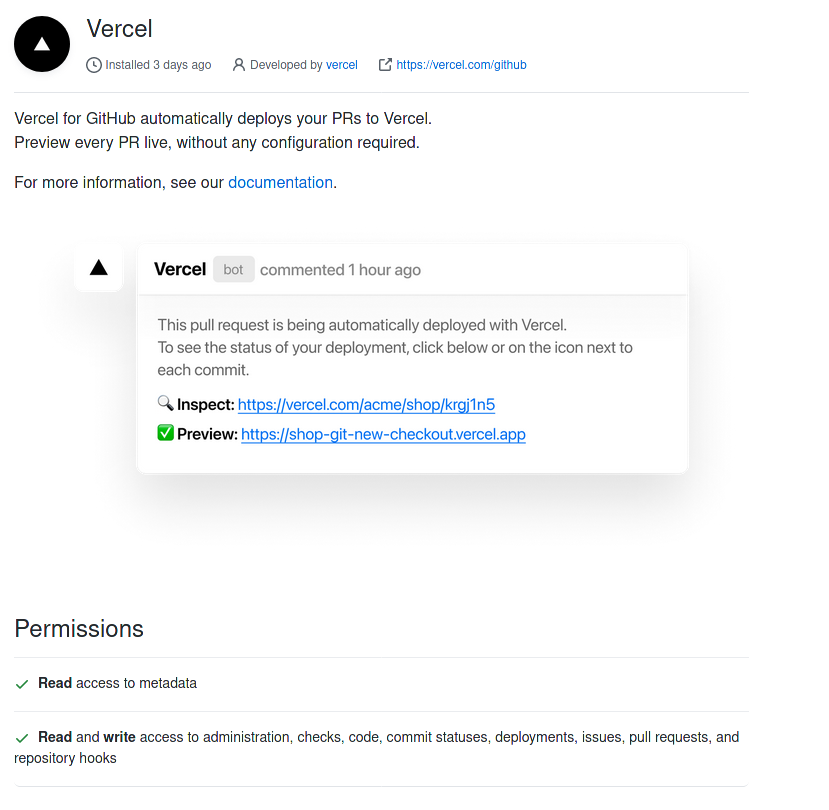
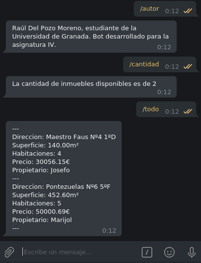

## Integración dentro del proyecto general (es decir, como todo el código deberá tener sus issues y/o HU correspondientes). En esta rúbrica se valorará que se haya ido más allá del despliegue de un ejemplo

---

He realizado el despliegue de un bot de Telegram, el cual se puede ver [aquí](https://github.com/rauldpm/InmobilIV_bot_telegram) en Vercel.

Para el despliegue en Vercel  he tenido que realizar los siguientes pasos:

1. Darme de alta en Vercel mediante la cuenta de GitHub
2. Realizar un deploy local del bot mediante el comando "vercel"

En dicha ejecución, indico los siguientes campos:

- Enlazar a un proyecto existente o no (NO, lo crea automático)
- Indicar el nombre del bot
- Directorio en el que esta el código (se indica ./ aunque el bot este en la carpeta api)

Una vez terminada la configuración realizara el despliegue en desarrollo y como se ve en la imagen, también en producción.

En ambos casos proporcionará un link el cual se utilizara para crear el webhook que enlazará Telegram con Vercel (se usa producción ya que desarrollo cambia con cada despliegue, obviamente hay que utilizar una version estable, no una version de desarrollo)

Este despliegue hará que en el Dashboard de Vercel aparezca el bot desplegado, que como se puede ver, no esta conectado a un repositorio de github.

El siguiente paso es conectarlo, para ello (y previamente) he estado desarrollando el bot en un repositorio de github, pero no lo he conectado ya que las pruebas las estaba haciendo desde local (por el limite de despliegues)

Asi, indico el nombre del repositorio:

Y como se vé, se ha conectado:

Ahora cuando se realize un cambio en el repositorio se desplegará en vercel.

¿Pero como se actualiza esto? Pues bien, en GitHub se habrá instalado una GitHub App llamada Vercel que dispone de permisos de escritura y lectura.

Ademas, como se puede ver a continuación, se puede ver como el bot responde a diferentes comandos, todo ello explicado en la rubrica 4.

---

He creado las siguientes Historias de usuario:

1. [#30 [HU5] AÑadir funcionalidad de Telegram Bot](https://github.com/rauldpm/InmobilIV/issues/30)

He creado los siguientes issues que hacen referencia al código de la función serverless desplegada:

1. [#29 Testear función serverless AWS](https://github.com/rauldpm/InmobilIV/issues/29)
2. [#28 Añadir función serverless en AWS](https://github.com/rauldpm/InmobilIV/issues/28)
3. [#27 Integrar funcionalidad serverless con AWS](https://github.com/rauldpm/InmobilIV/issues/27)

Esta issue fue un intento de desplegar en Firebase hasta que me di cuenta que el proyecto en Kotlin se basaba en Android y no permitía el despliegue del mio por la estructura. A partir de aquí intensifiqué la búsqueda de información para asegurarme de que podía hacerlo antes de lanzarme (la mayoría de las pruebas de las web para probar si funcionaba han sido en local).

4. [#31 Integrar funcionalidad serverless con Firebase](https://github.com/rauldpm/InmobilIV/issues/31)
5. [#33 Añadir fichero 5.json](https://github.com/rauldpm/InmobilIV/issues/33)