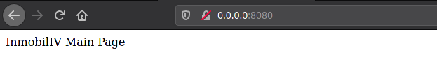

## Rubrica 1

### Justificación técnica del framework elegido para el microservicio con documentación sobre cómo se usa en la práctica.

---

Para elegir un framework he investigado entre los que se enumeran a continuación:

  - Spring
    - Muy completo, el mas usado por su antigüedad, permite utilizar código sin necesidad de crear un proyecto, al ser mas completo es el mas pesado.
  - Vert.x
    - Fácil manejo de eventos asíncronos
  - Spark
    - Dispone de sintaxis declarativa para evitar repetir código
  - Ktor
    - Desarrollado por JetBrains, posiblemente tenga alta compatibilidad con el proyecto, que se esta basando en código de oficial JetBrains.
    - Orientado en uso de JVM, capacidad de uso para generar diferentes pipelines para procesar peticiones HTTP y eventos a la API.


Debido a estas características voy a decidirme a usar Ktor, ya que encaja perfectamente con el desarrollo del proyecto actual, ademas, como otro software usado en el proyecto, es desarrollado por JetBrains.

Ademas, dispone de un motor propio para testear tanto unitariamente (esto ya se hace con junit) como para realizar test de integración y de estrés, llamado TestEngine, que ademas no precisa de tener que iniciar el servidor para realizar los test de integración, sino que simula su funcionamiento para no iniciarlo.

Para añadir el framework al proyecto basta con añadir en las dependencias lo siguiente:

```
val ktor_version = "1.4.3"

implementation("io.ktor:ktor-server-netty:`$`ktor_version")
implementation("io.ktor:ktor-freemarker:`$`ktor_version")
testImplementation("io.ktor:ktor-server-test-host:`$`ktor_version")
```

Estas tres dependencias son necesarias tanto para el uso del framework como para realizar los test, a continuación se explica que realiza cada uno:

1. [ktor-server-netty](https://api.ktor.io/1.2.1/io.ktor.server.netty/-netty/)
   - Esto es el framework en si, incorpora el motor con el que se va a ejecutar el servidor
2. [ktor-freemarker](https://ktor.io/docs/freemarker.html)
   - Necesario para incorporar ficheros con contenido html, esto no es necesario aun, pero me parece imprescindible añadirlo junto al framework, ya que, aunque no se genere código html en si aun, creo que es necesario disponer de un medio para hacerlo.
   - Dichos ficheros con contenido html se ubican en una carpeta resources separada del código principal.
3. [ktor-server-test-host](https://ktor.io/docs/servers-testing.html) (TestEngine)
   - Necesario para simular el servidor en funcionamiento y ejecutar los test de integración.
   - Aunque los test se realizan con el mismo formato que los test unitarios, mediante JUnit5, esta dependencia añade la funcionalidad necesaria para hacer peticiones get a las rutas diseñadas en el framework.

Para el desarrollo de las rutas, he creado un fichero llamado "[Main.kt](../../app/src/main/kotlin/Main.kt)", el cual contiene dos métodos, el "main" como tal, el cual lanza el servidor indicando el motor, el puerto y llamando al segundo método, llamado "Application.modules()", el cual se encarga de instalar lo necesario para el funcionamiento, como las rutas o los estados de paginas.

Ademas, al instalar las rutas, se hace la declaración de dichas rutas, con el siguiente formato (por ejemplo para la ruta raíz):

```
install(Routing) {
  get("/") {
    TODO
  }
}
```

En el caso de que se quieran pasar parámetros por GET, habría que especificarlo de la siguiente forma:

```
get("/pagina/{param1}/{param2}") {
  TODO
}
```

Donde {param1} es el valor de la clave que contiene el valor pasado en la url.

Para obtener dicho valor, se habría de la siguiente forma:

```
 val value = call.parameters["param1"]
```

Una vez que se haya realizado la funcionalidad en la llamada, hay que realizar una respuesta, para ello, se hace uso de la función "call.response()" y "call.respond()"

- call.response()
  - Permite responder codigos de estado, cabeceras, etc.
- call.respond()
  - Permite responder con ficheros html, directamente con texto html, etc.

A continuación se va a ver dos ejemplos, uno respondiendo un fichero y otro respondiento codigo html directamente:

```
call.response.header("Location", "/")
call.response.status(HttpStatusCode.OK)
call.respond(FreeMarkerContent("index.ftl", null))
```

```
call.response.header("Location", "/inmuebles")
call.response.status(HttpStatusCode.OK)
call.respondText(inmuebles.toString(), ContentType.Text.Html)
```

En ambos casos se hace una respuesta con un código 200 (OK), en el primer caso se responde con un fichero que contiene una cadena de texto y en el segundo caso se responde con un objeto Inmuebles, que contiene los inmuebles almacenados en un fichero json. Este objeto se parsea a string para su lectura en html indicado mediante "ContentType.Text.Html".

Para iniciar el servidor habría que añadir en el taskrunner que la aplicación va a tener una clase principal, de forma que cuando se haga la tarea interna "gradle run", se ejecutará dicha clase principal, para esto hay que añadir lo siguiente en el fichero [build.gradle.kts](../../app/build.gradle.kts):

```
application {
    mainClassName = "com.inmobiliv.MainKt"
}
```

Para permitir el uso de ficheros con contenido HTML, hay que añadir en la función Application.modules() la extension añadiendo lo siguiente:

```
    install(FreeMarker){
        templateLoader = ClassTemplateLoader(this::class.java.classLoader, "templates")
    }
```

Y para que la petición responda con un fichero se debe llamar de la siguiente forma:

```
call.respond(FreeMarkerContent("index.ftl", null ))
```

Donde "null" podría ser un map de objetos a pasarle al template [index.ftl](../../app/src/main/resources/templates/index.ftl).

Al ejecutar el servidor se vería lo siguiente:



Pero como ya he dicho anteriormente, esto no se pide para el hito, pero lo he realizado porque con la instalación del framework, he querido dejarlo hecho.