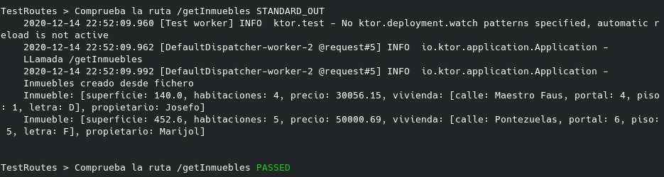

## Rubrica 3

### Uso de buenas prácticas: configuración distribuida, logs, uso de middleware.

---

He utilizado un sistema de logs llamado "[logback](https://logback.qos.ch/)" que es un sucesor de "[SLF4J](http://www.slf4j.org/", ya que es el utilizado por el framework "Ktor".

Para utilizarlo hay que añadirlo en las dependencias del proyecto mediante la siguiente linea:

```
compile("ch.qos.logback:logback-classic:1.2.3")
```

Ahora, donde queramos realizar llamadas al log, habrá que crear un objeto "logger" de la siguiente forma:

```
val logger = LoggerFactory.getLogger(this::class.java.canonicalName)
```

Y donde se quiera generar un log, escribir el siguiente código:

```
logger.info(mensaje)
```

Por ejemplo, en el fichero "[Main.kt](../../app/src/main/kotlin/Main.kt)", se puede observar su uso, en concreto, en la ruta "get(/getInmuebles)", se utiliza 3 veces, primero para informar el acceso a dicha ruta y después para informar del éxito o error de la operación. 

En este caso, el log muestra un mensaje con los inmuebles consultados:



Este log utiliza el siguiente formato:

```
fecha hora evento nivel estado respuesta
```

Para lograr este resultado, he creado un fichero de configuración llamado [logback.xml](../../app/src/main/resources/logback.xml) donde se encuentra la configuración usada.

