## Hito 4 R2 - Configuración de algún sistema de integración continua adicional (justificado de la misma forma).

Para el segundo sistema de CI he decidido usar Jenkins.

### Indice
1. [Instalación Jenkins](#id1)
2. [Configuración Jenkins](#id2)
3. [Configuración Webhook GitHub](#id3)
4. [Ejecución correcta CI](#id4)

---
## 1. Instalación Jenkins 
El primer paso es instalarlo, en mi caso, mediante la orden:

> sudo pacman -S jenkins

Una vez instalado, se puede acceder en la siguiente dirección local:

> http://localhost:8090

---
## 2. Configuración Jenkins 
Al entrar, pedirá una contraseña que habrá generado en una ruta indicada, al introducirla se vera lo siguiente:

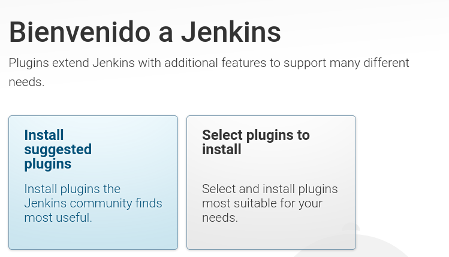

En esta pestaña pulso "Select plugins to install", donde indicaré que módulos quiero instalar.

En este caso lo dejo igual pero desmarco "Ant" ya que no lo uso y selecciono "Embeddable Build Status" para poder crear un link que muestre el estado desde donde quiera.

Al terminar, se instalara lo seleccionado.

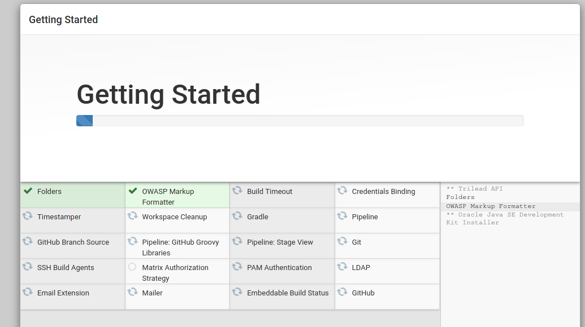

El ultimo paso sera crear un usuario admin.

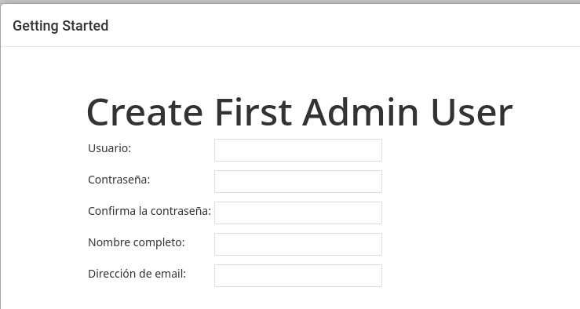

Una vez completado se vera la pagina principal de Jenkins:

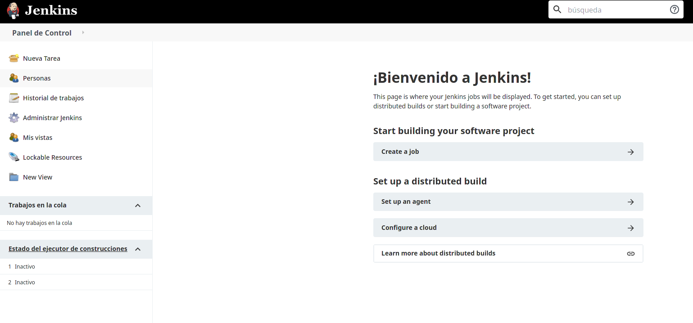

Ahora el paso es conectar GitHub para que obtenga el repositorio, esto se realiza mediante un "pipeline".

Para esto se pulsa en:

1. Nueva tarea

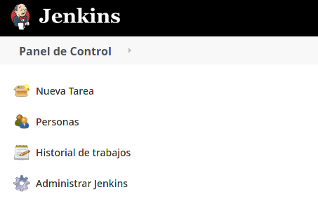

2. Pipeline (hay que introducir un nombre)

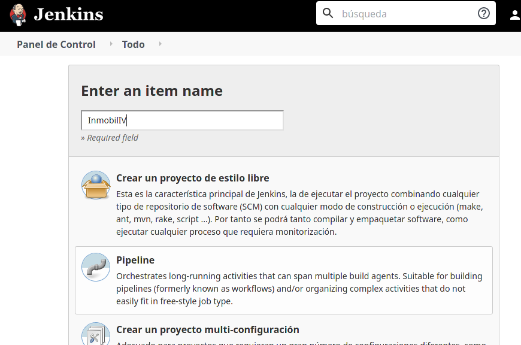

3. Configurarlo

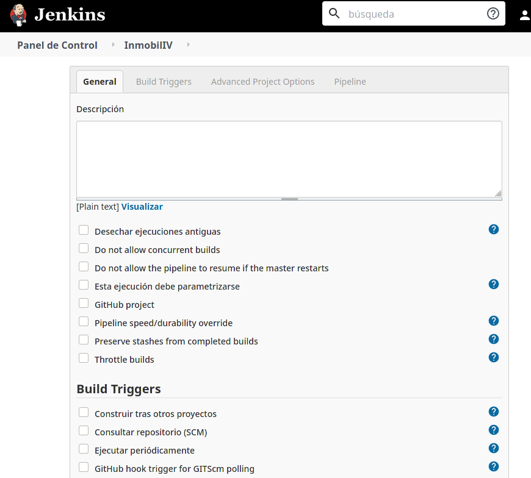

En este apartado hay que marcar en la sección "Build Triggers" lo siguiente:

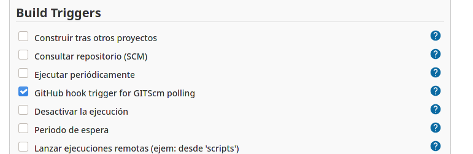

De esta forma si se realiza un push, saltará el Trigger.

Bajando un poco mas se podrá definir el repositorio en la sección "Pipeline", de la forma siguiente:

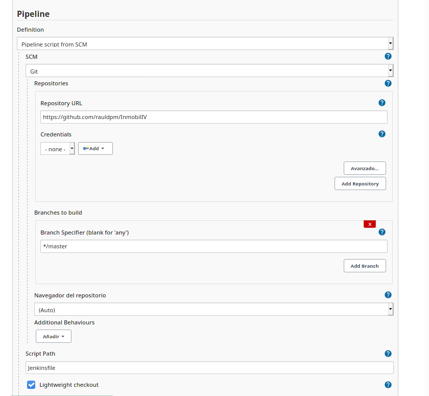

En la imagen superior se puede ver como se ha especificado que el repositorio mediante la URL y la rama MASTER.

Ahora hay que añadir un fichero de configuración que se llamara **Jekinsfile** y que se puede consultar [aquí](../Jenkinsfile).

El fichero contiene básicamente la orden de construir la imagen docker y ejecutarla ya que voy a aprovechar Docker.

---
## 3. Configuración Webhook GitHub 

El siguiente paso es añadir un "Webhook" en GitHub, para ello, hay que ir a "Settings" del repositorio y a la opción "Webhooks".

Aquí viene un problema, y es que Jenkins es un servidor LOCAL que no tiene acceso a internet, por lo que se necesita de una aplicación para crear un túnel entre GitHub y Jenkins, la cual va a ser **smee.io**.

Primero hay que empezar un channel en la web [smee.io](https://smee.io/), al pulsar sobre el botón, aparecerá una pagina en la que proporcionará una URL y una serie de ordenes.

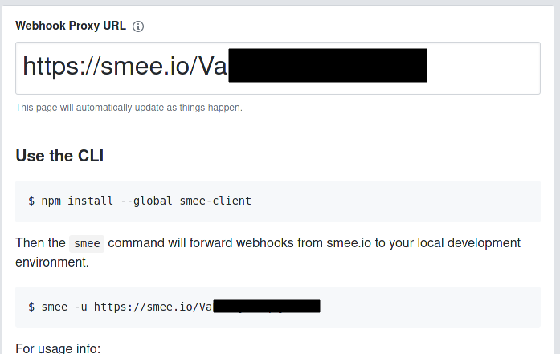

El siguiente paso es instalar el cliente mediante:

> npm install --global smee-client

Y después ejecutar el cliente con el código proporcionado mediante la orden:

> smee -u https://smee.io/**CODIGO** --path /github-webhook/ --port 8090

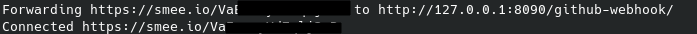

Ahora en el webhook de GitHub, hay que introducir la siguiente dirección payload:

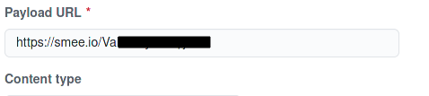

Y al aceptarlo se vería junto al otro webhook de Docker:

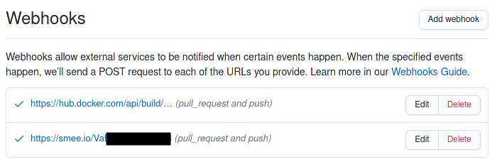

Una vez que se realize un push o PR, la web donde se ha obtenido el código cambiará y mostrara un historial de las acciones realizadas.

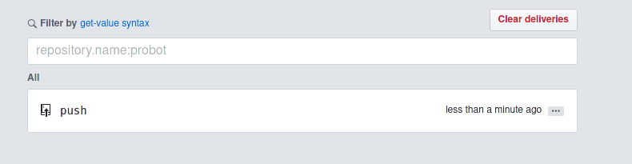

---
## 4. Ejecución correcta CI 

Esto lanzará en Jenkins las tareas, en este caso, la de construir la imagen y ejecutar los test de docker, como se puede ver en la siguiente imagen:

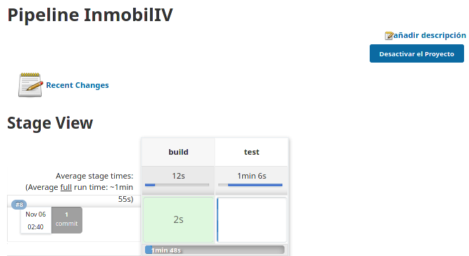

Si finaliza correctamente aparecerá en verde con el tiempo que ha tardado:

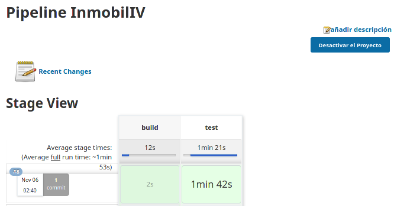

Si se entra en el log de consola de dicha ejecución, se podrá observar las acciones que realiza:

1. Build correcto de la imagen

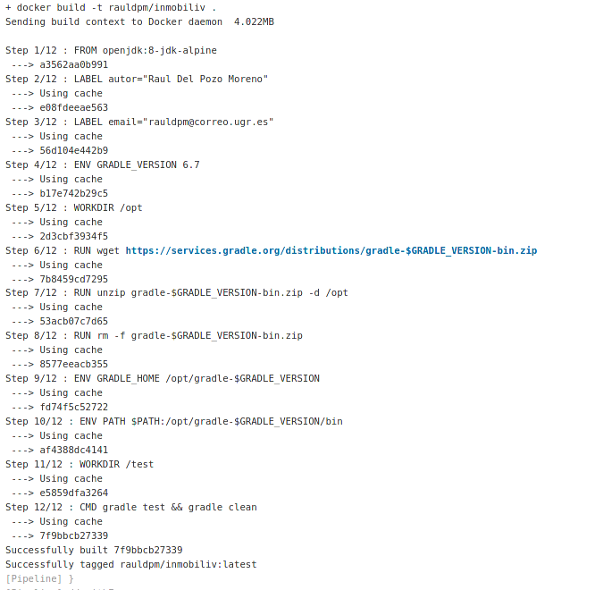

2. Test correctos en docker

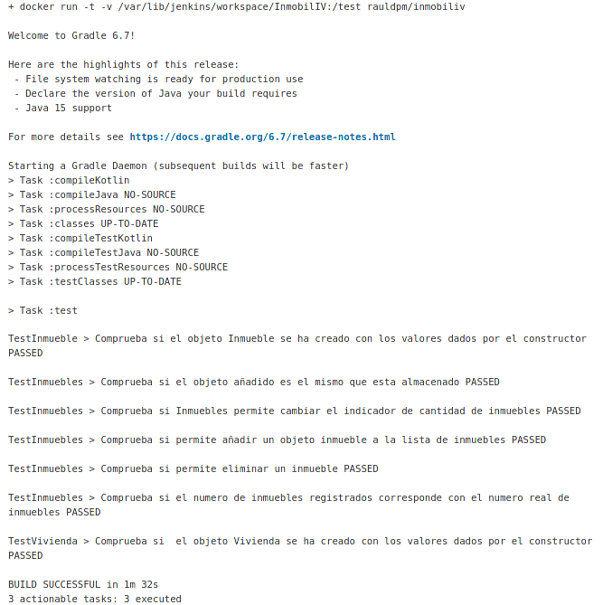