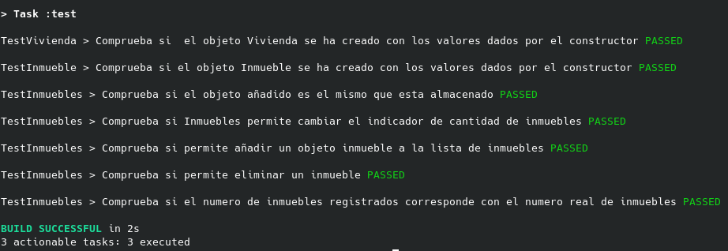

## Progreso del proyecto

En este fichero se pretende mostrar qué se ha ido realizando en el proyecto diferenciándolo entre hitos.

### Indice

1. [Hito 0](#id0)
2. [Hito 1](#id1)
3. [Hito 2](#id2)

---
### 1. Hito 0 

- Creación del repositorio en GitHub y clonado en local.
- Se ha configurado diversos aspectos necesarios, tales como las claves SSH y el perfil de GitHub. Dichas configuraciones se pueden ver [aquí](config.md)
- Se han añadido diversos ficheros principales en la raíz del proyecto tales como:
    1. .gitignore
    2. LICENSE
    3. README.md

---
### 2. Hito 1 

- Se ha creado un label en GitHub llamado [*user-stories*](https://github.com/rauldpm/InmobilIV/labels/user-stories) de color verde mediante el cual, se pueden ver las historias de usuario creadas.
- Se ha añadido un fichero [iv.yaml](../iv.yaml) con parámetros de configuración para tests, con el campo entidad apuntando a la clase creada.
- Se ha actualizado el fichero [.gitignore](../.gitignore) con los ficheros a excluir del lenguaje *Kotlin*
- Se puede encontrar la documentación en el fichero [README.md](../README.md) del repositorio y en la [carpeta de documentacion](../docs/).
- Se ha creado una clase básica llamada [vivienda.kt](../src/main/kotlin/com/inmobiliv/vivienda.kt)
- Se pueden encontrar las historias de usuario, issues y milestones creados en el siguiente [enlace](issues.md), así como en la propia pestaña de [issues](https://github.com/rauldpm/InmobilIV/issues) del repositorio de GitHub.

---
### 3. Hito 2 
- Se ha actualizado el fichero de configuración de test [iv.yaml](../iv.yaml) con los nuevos campos necesarios.
- Se ha instalado el gestor de tareas Gradle como se puede ver [aqui](../docs/instalacion.md).
- Se ha configurado el gestor de tareas Gradle, como se puede ver en los ficheros:
  - [build.gradle.kts](../build.gradle.kts)
  - [settings.gradle.jts](../settings.gradle.kts)
- Este gestor incorpora un sistema de dependencias en el archivo [build.gradle.kts](../build.gradle.kts) bajo la etiqueta **dependencies**, por lo cual, no hace falta instalarlas localmente.
- También trae una serie de tareas por defecto para compilar el código sin tener que hacer un build o ejecutar test, que son:
    - gradle compileKotlin
    - gradle compileTestKotlin
- Se han creado diversas tareas como se puede ver en el fichero:
  - [build.gradle.kts](../build.gradle.kts)
  - En concreto se han creado dos tareas para probar la dependencia entre tareas, una tarea principal llamada "test" que ejecuta los tests propios del proyecto, localizados [aqui](../src/test/kotlin/com/inmobiliv/) y una tarea llamada "compila" que ejecuta la compilación de los ficheros del proyecto y los test a la vez.
- Se ha añadido la clase [Inmuebles](../src/main/kotlin/com/inmobiliv/inmuebles.kt) que agrupa un conjunto de objetos [Inmueble](../src/main/kotlin/com/inmobiliv/inmueble.kt).
- La clase [Inmueble](../src/main/kotlin/com/inmobiliv/inmueble.kt) se ha modularizado dividiendo la clase en dos (una de ellas busca emular un struct, ya que en kotlin no hay). 
  - Ahora hay una clase "Vivienda" que hace referencia a los datos de la vivienda (dirección, piso, letra...) y una clase "Inmueble" que referencia la Vivienda con una serie de características (superficie, precio, propietario...)
- Se ha implementado tres clases de testeo:
  - [testVivienda.kt](../src/test/kotlin/com/inmobiliv/testVivienda.kt)
  - [testInmueble.kt](../src/test/kotlin/com/inmobiliv/testInmueble.kt)
  - [testInmuebles.kt](../src/test/kotlin/com/inmobiliv/testInmuebles.kt)
- Se puede ver en la siguiente imagen los test realizados al ejecutar el comando **gradle test**:

- No se han cerrado issues debido a que están aun en desarrollo.
- Se han abierto dos nuevas historias de usuario:
  - [#12 [HU3] Como desarrollador, quiero ser capaz de poder testear las clases relacionadas con Inmuebles](https://github.com/rauldpm/InmobilIV/issues/12)
  - [#13 [HU4] Como usuario, quiero ser capaz de ver los inmuebles disponibles](https://github.com/rauldpm/InmobilIV/issues/13)