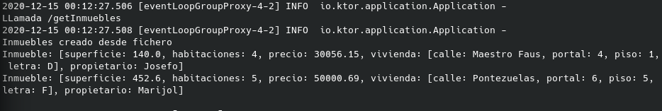
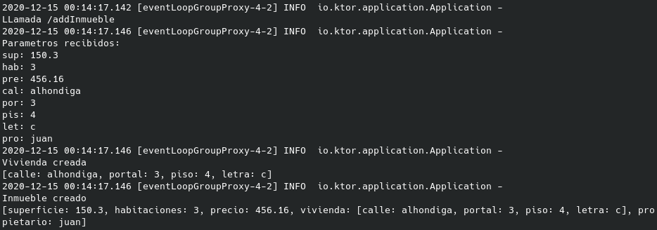
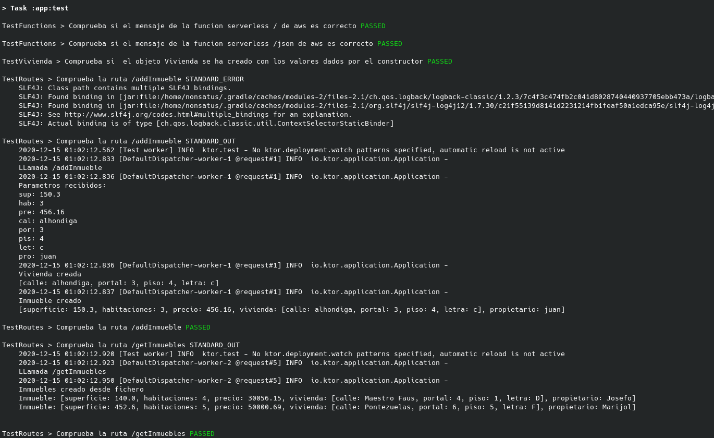
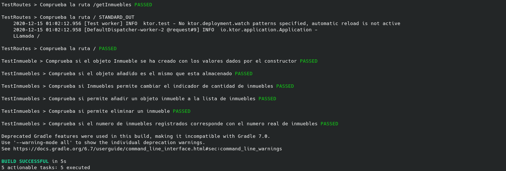

## Rubrica 2 y 4

### Diseño en general del API, las rutas (o tareas), tipos devueltos por las peticiones y estados devueltos por las mismas, tests y documentación de todo, justificando como se ajustan a las historias de usuario, de forma que reflejen correctamente un diseño por capas que desacopla la lógica de negocio del API.

### Tests correctos y de acuerdo con las historias de usuario.

### Indice
- [Diseño rutas, estados, peticiones](#id1)
- [Tests](#id2)

---

### 1. Diseño rutas, estados y peticiones <a id="id1"></a>

Este punto ya se ha comentado un poco en la rubrica 1, el diseño de las rutas se ha realizado en un método llamado "Application.module()", el cual seria llamado al iniciar el servidor.

Este método realiza la instalación de:

1. Cabeceras por defecto
2. Estados de pagina
3. Utilidad para utilizar ficheros con contenido html
4. Rutas


Las cabeceras por defecto, instaladas mediante la siguiente orden, añade una serie de cabeceras a las respuestas Http:

```
install(DefaultHeaders)
```

Los estados de pagina, permiten especificar códigos de respuesta en las peticiones de las rutas, como pueden ser el error 500 (Internal Server Error) o un código 200 (OK).

Su instalación se realiza mediante la orden:

```
install(StatusPages) {
    exception<Throwable> {
        cause -> call.respond(HttpStatusCode.InternalServerError)
        throw cause 
    }
}
```

Ademas, he añadido una clausula exception en caso de que ocurra algún problema, el cual lanzará el error InternalServerError, con código 500.

El siguiente paso ha sido especificar el modulo para utilizar ficheros con código Html (FreeMarker)

```
install(FreeMarker){
    templateLoader = ClassTemplateLoader(this::class.java.classLoader, "templates")
}
```

Ademas, se le puede indicar la carpeta en la que encontrará los ficheros con contenido html, llamada "templates". Estos ficheros deben tener extension ".ftl".

Finalmente, se instala el modulo con las rutas (Routing), donde se especificaran las rutas de la aplicación.

Por ahora he especificado tres rutas:

1. /
2. /getInmuebles
3. /addInmueble

La primera ruta / sirve el contenido de un fichero llamado "[index.ftl](../../../app/src/main/resources/templates/index.ftl)", que contiene una sola frase: "InmobilIV Main Page", que tiene el propósito de servir la pagina principal.

En dicha ruta primero se realiza una llamada al logger para registrar una llamada a esta ruta mediante:

```
logger.info("\nLLamada /")
```

Acto seguido crea una respuesta a la cabecera con un código de estado 200 (OK):

```
call.response.header("Location", "/")
call.response.status(HttpStatusCode.OK)
```

Utilizo el código 200 porque lo único que realiza esta ruta es servir contenido html.

Produciendo el siguiente resultado:


La segunda ruta "/getInmuebles" se encarga de realizar la lectura de todos los inmuebles registrados en la aplicación.

Como por ahora no existe una DB, leo la informacion de un fichero json con información de dos inmuebles, para esto, he tenido que instalar una dependencia que me permita la lectura y escritura en ficheros json.

Esto lo he hecho añadiendo la dependencia "gson":

```
implementation("com.google.code.gson:gson:2.8.5")
```

Que realiza la lectura mediante las dos siguientes lineas:

```
val gson = Gson()
val inmuebles: Inmuebles = gson.fromJson(FileReader("src/main/resources/data/data.json"), Inmuebles::class.java)
```

La primera linea crea un objeto Gson, que sera el encargado de realizar la lectura y el la segunda linea realiza la lectura almacenando la información leída en un objeto de tipo "Inmuebles", que contiene un array de tipo Inmueble.

Para que realize esto, es necesario indicarle al objeto Gson, que la lectura json se va adaptar a un tipo determinado de objeto, que se hace mediante la declaración "Inmuebles::class.java", de esta forma, la lectura se va a adaptando internamente a la estructura del objeto, incluyendo las clases internas como Vivienda o Inmueble dentro de esta clase Inmuebles.

Esta dependencia es muy cómoda ya que no es necesario leer el fichero y adaptar la lectura a la estructura del objeto sino que lo hace por su cuenta.

Una vez que se ha leído la información, indico mediante el log que se ha creado un objeto con la información y muestro la información leída mediante la orden:

```
logger.info("\nInmuebles creado desde fichero\n" + inmuebles)
```

Finalmente, se realiza una respuesta de cabecera y código de estado 200 (OK) (No uso código 201 Created porque la finalidad no es crear un objeto, sino mostrar la información)

```
call.response.header("Location", "/inmuebles")
call.response.status(HttpStatusCode.OK)
```

Y haciendo la respuesta de la información leída mediante:

```
call.respondText(inmuebles.toString(), ContentType.Text.Html)
```

Produciendo el log el siguiente resultado por pantalla:



Todo esto ocurre dentro de una sentencia try-catch, de forma que si durante la lectura o la respuesta ocurre algún error, se informará mediante el logger del error producido y creara una respuesta con código de error 500 y responderá con la excepción en vez de con los datos leidos.

```
logger.info("\nExcepcion encontrada /inmuebles\n" + e)

call.response.header("Location", "/inmuebles")
call.response.status(HttpStatusCode.InternalServerError)
call.respondText("Excepcion '" + e + "'")
```

La tercera ruta diseñada corresponde con "/addInmueble", que tiene la finalidad de crear un objeto con una serie de parámetros dados y, si se tuviera una DB, insertarla (pero esto no se hace aun, asi que por ahora solo crea el objeto).

Hay que decir que este framework no utiliza los parámetros get de la forma:

```
/ruta?key=value&key1=value1...
```

Sino que utiliza la sintaxis:

```
/ruta/value/value1/value2
```

Siendo en la URL del navegador los valores y en la función de ruta especificadas las keys.

De esta forma asocia una key con un valor en función de su posición.

Primero, informa al logger que se ha accedido a esta ruta.
Segundo, obtiene los parámetros dados mediante la siguiente forma:

```
val sup = call.parameters["sup"].toString().toDouble()
val hab = call.parameters["hab"].toString().toInt()
val pre = call.parameters["pre"].toString().toDouble()
val cal = call.parameters["cal"].toString()
val por = call.parameters["por"].toString().toInt()
val pis = call.parameters["pis"].toString().toInt()
val let = call.parameters["let"].toString().single()
val pro = call.parameters["pro"].toString()
```

Todas estas variables son necesarias para crear un Inmueble, y en la misma lectura de parámetro realizo un parsing al tipo de dato.

Una vez obtenido los parámetros, informo al logger que se han leído los parámetros y marco los parámetros leidos:

```
logger.info("\nParametros recibidos: " + "\nsup: " + sup + "\nhab: " + hab + "\npre: " + pre + "\ncal: " + cal + "\npor: " + por + "\npis: " + pis + "\nlet: " +let + "\npro: " + pro )
```

Ahora creo un objeto Vivienda con los datos necesarios, los informo al logger y hago lo mismo con un objeto Inmueble:

```
val viv = Vivienda(cal, por, pis, let)
logger.info("\nVivienda creada\n" + viv)

val inm = Inmueble(sup, hab, pre, viv, pro)
logger.info("\nInmueble creado\n" + inm)
```

De esta forma permito que quede registrada la creación de dichos objetos con unos valores específicos.

En este punto ya tendría creado el objeto Inmueble que seria almacenado, por lo que por ahora, aquí termina el proceso.

El ultimo paso seria crear la respuesta a la cabecera y al código de estado (en este caso si utilizo un código 201 Create)

```
call.response.header("Location", "/addInmueble/{sup}/{hab}/{pre}/{cal}/{por}/{pis}/{let}/{pro}")
call.response.status(HttpStatusCode.Created)
```

Y finalmente crear una respuesta con un mensaje de confirmación

```
call.respondText("Inmueble creado con exito")
```

Todo esto crearía el siguiente resultado:




---


### 2. Tests <a id="id2"></a>

Como ya indiqué en la rubrica 1, el framework elegido incorpora su propio motor para simular el funcionamiento del servidor sin tener que iniciarlo, mediante TestEngine, que incorpora internamente.

Ademas, el sistema de test que he usado para la realización de tests unitarios también sirve para la realización de test de integración.

Para esto he creado un fichero llamado "[testRoutes.kt](../../../app/src/test/kotlin/testRoutes.kt) que contendrá tests para las rutas diseñadas mas arriba.

A diferencia de los test unitarios, hay que importar las herramientas que permitirán hacer una simulación del servidor, que son:

```
import io.ktor.application.*
import io.ktor.http.*
import io.ktor.server.testing.*
import kotlin.test.*
```

Aquí he creado una clase llamada "TestRoutes" (se tiene que llamar como el fichero) que contiene tres métodos, uno para cada ruta diseñada.

El primer test testea la ruta "/", con el siguiente código:

```
@Test
@DisplayName("Comprueba la ruta /")
fun testRouteRoot() = withTestApplication(Application::module){
    with ( 
        handleRequest(HttpMethod.Get, "/") 
    ) {
        assertEquals(HttpStatusCode.OK, response.status())
        assertEquals("InmobilIV Main Page", response.content)
    }
}
```

Primero se indica que es un test mediante "@Test", después se indica un mensaje para relacionar el test cuando se ejecute mediante "@DisplayName" y finalmente el método test.

Para realizar un test de una ruta, hay que utilizar el siguiente formato:

```
withTestApplication(Application::module){
    with ( 
        handleRequest(HttpMethod.Get, "/") 
    ) {
        assertEquals(HttpStatusCode.OK, response.status())
        assertEquals("InmobilIV Main Page", response.content)
    }
```

El cual indica que se va a realizar usando una Application (lo que llama el servidor al iniciarse en el main) realizando una llamada al metodo "Application.modules()", que es el que contiene el diseño de las rutas.

Después indica que se va a realizar un handleRequest mediante Get a la ruta "/".

Y finalmente se especifica que tiene que testear. En este primer caso, en el que dicha ruta sirve el contenido de un fichero, he comparado dicho contenido con la cadena que debiera ser.

Ademas, compruebo que el código que retorna la petición es 200 (OK), que indicaría que se ha servido sin problemas.

```
assertEquals(HttpStatusCode.OK, response.status())
assertEquals("InmobilIV Main Page", response.content)
```

Para la ruta "/getInmuebles" se realiza lo mismo pero sin comprobar lo que se sirve, ya que es un contenido muy extenso y puede variar según el contenido que lea, en este caso solo comprueba que es un código 200.

Finalmente, para la ultima ruta, que crea un objeto con parámetros por Get, a la hora de realizar el handleRequest mediante Get a una ruta, hay que simular que dicha ruta tiene unos valores determinados para crear dicho objeto, como se puede ver a continuación:

```
with ( 
handleRequest(HttpMethod.Get, "/addInmueble/150.3/3/456.16/alhondiga/3/4/c/juan") 
) {
assertEquals(HttpStatusCode.Created, response.status())
assertEquals("Inmueble creado con exito", response.content)
}
```

Ademas, se comprueba que el mensaje que sirve de éxito es de éxito y que el código de estado es 201 (Created).

Como se sigue usando JUnit5, la misma orden que ejecuta los test unitarios ejecuta estos test, por lo que la orden para realizar los test sigue siendo:

```
gradle test
```

Que al ejecutarse permite ver como se pasan todos los test y se hacen las llamadas log de las rutas:


