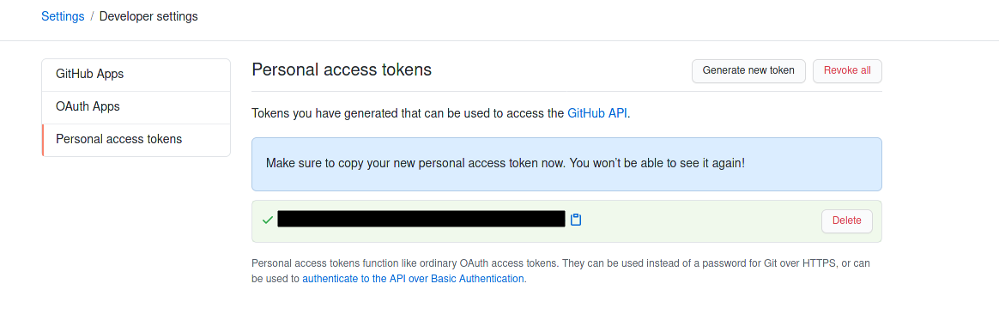
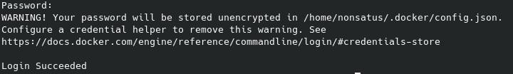
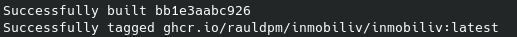
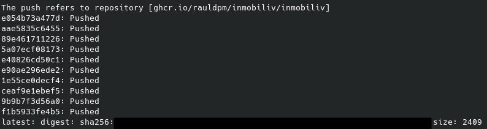
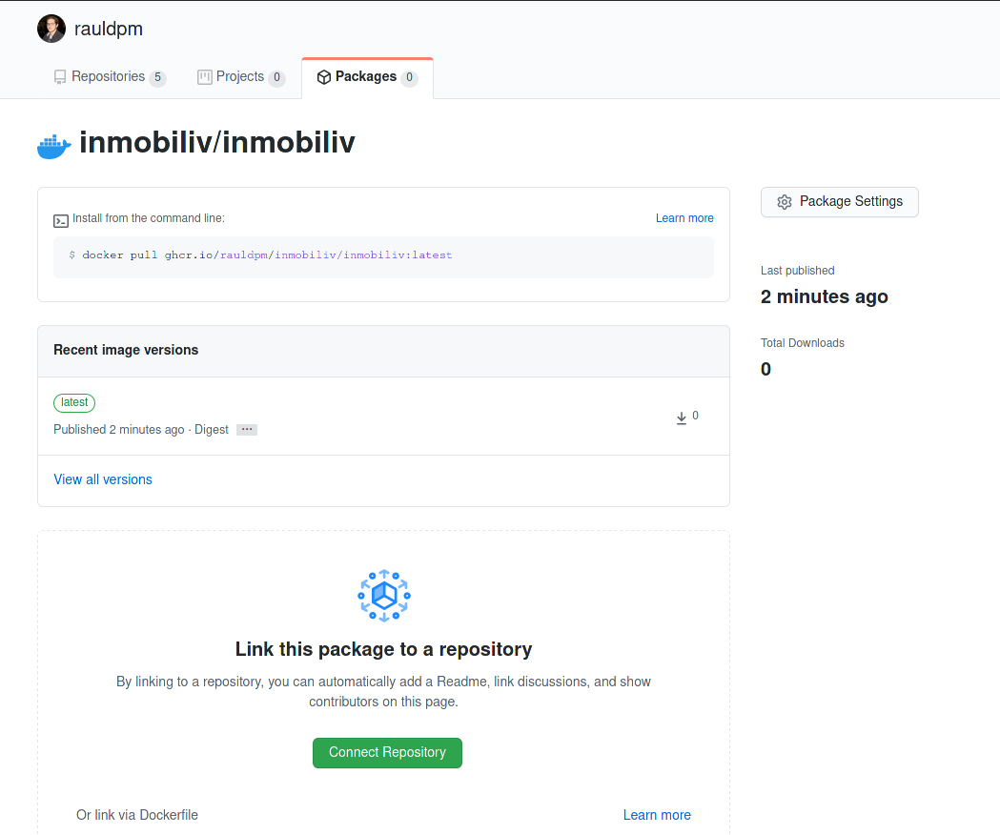
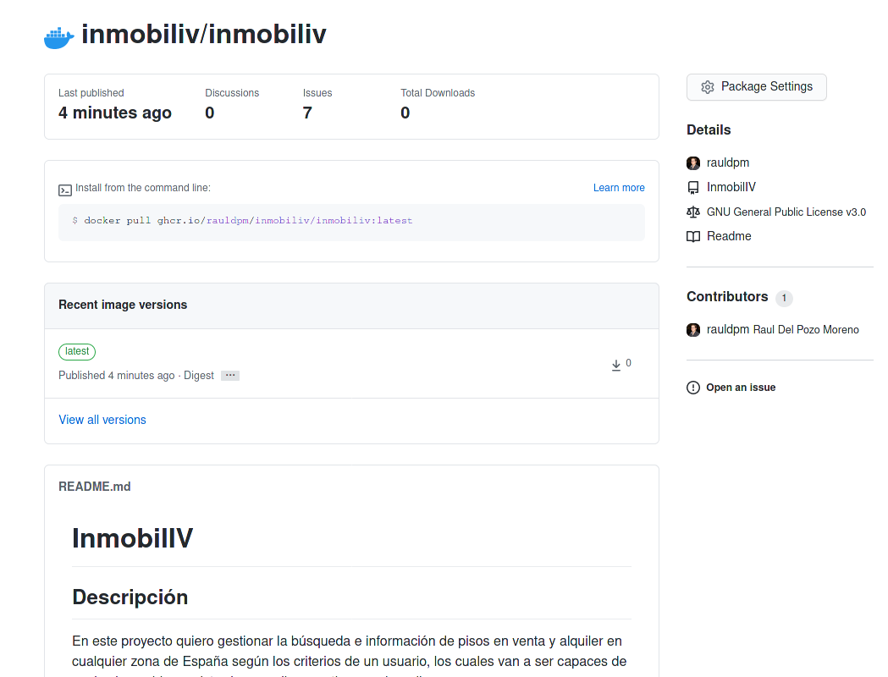

## R4 Uso de registros alternativos. GitHub Container Registry

---

## GitHub Container Registry

En este fichero se va a tratar de explicar el procedimiento de configuración del registro de contenedores de GitHub.

---

Primero hay que generar un token en GitHub en la siguiente dirección, donde hay que pulsar sobre Generate new token:

> Settings > Developer settings > Personal access tokens

En la pagina que aparecerá habrá que añadir una nota para identificar el token y marcar permisos de escritura.

Una vez generado el token lo podremos copiar:

Una vez con el token copiado, se podrá usar para identificarse mediante el comando:

> docker login ghrc.io -u rauldpm

Si el login ha sido exitoso informará sobre donde se almacena la contraseña y un "Login Succeeded".

El siguiente paso es realizar el build de la imagen indicando la ruta al repositorio de ghcr mediante el comando:

> docker build . -t ghcr.io/rauldpm/inmobiliv/inmobiliv:latest

Que al terminar mostrara el resultado correcto:

Y a continuación subirlo al repositorio:

> docker push ghcr.io/rauldpm/inmobiliv/inmobiliv:latest

Una vez realizado el push, se podrá encontrar en GitHub en el apartado "Your Profile" > Packages.

El siguiente paso es enlazarlo al repositorio, para ello, se pulsará sobre el botón verde, donde habrá que elegir el repositorio deseado.

Una vez hecho esto, se podrá ver como se ha actualizado con el README del repo:

En dicha página se proporciona además un comando para realizar un pull de la imagen:

> docker pull ghcr.io/rauldpm/inmobiliv/inmobiliv:latest

