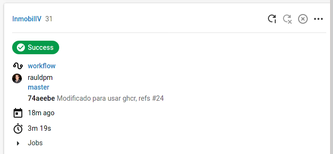
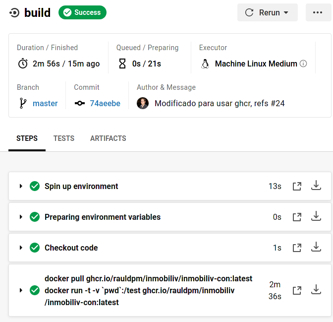
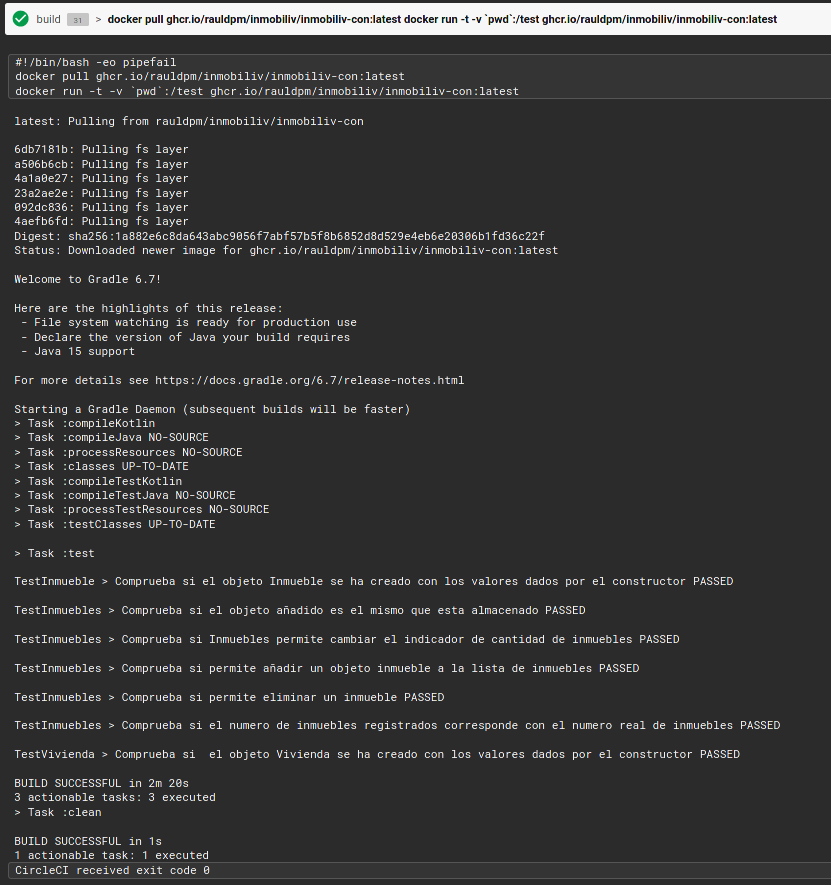
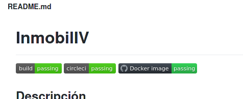

## Intregación continua con Circle-CI

## Indice
1. [Configuración](#id1)
2. [Funcionamiento correcto](#id2)

---
## 1. Configuración 

Primero hay que identificarse en la [Web](https://circleci.com/integrations/github/) con las credenciales de GitHub.

Cuando entre, se podrán ver los repositorios en propiedad, en el que habrá que pulsar "Set Up Project" del repositorio deseado.

Al pulsar mostrará una configuración inicial preguntando si se desea pushear al repositorio el archivo configuración predeterminado, esto no es lo deseado, ya que he creado una configuración propia para ejecutar docker, se puede consultar [aquí](../../../.circleci/config.yml)

Por tanto, se pulsa sobre "Use existing config" y mostrara otra ventana indicando que hay que iniciar la construcción.

Esto habrá añadido un nuevo webhook al repositorio:

---
## 2. Funcionamiento correcto 

Ahora, cada vez que se realiza un push o PR, se lanzara el trabajo en Circle-CI, y si es correcto, lo indicara:

Si se entra en el trabajo, se puede ver con mas detalle:

Y si se va a la ejecución de docker, se puede ver en el log que los test han pasado:

También en GitHub se puede observar el estado:

Y mediante el status badge en el README del repositorio:

