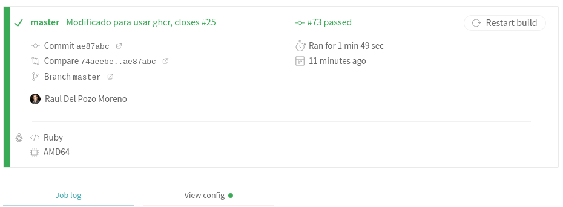

## R4 - Aprovechamiento del contenedor de Docker generado en el hito anterior en alguno de los sistemas de CI, especialmente si hay un cambio o adaptación del mismo.

---

Este fichero corresponde con el fichero actual en uso, el cual se puede consultar [aquí](../../../.travis.yml).

Para este caso, solamente habría que indicar que se va a usar Docker mediante el tag "services:" y realizar las ordenes correspondientes de docker.

Para el uso de la imagen del contenedor he reutilizado la imagen subida a GHCR.

En este [enlace](https://travis-ci.com/github/rauldpm/InmobilIV/builds/199334735) se puede observar el correcto funcionamiento de la integración continua utilizando Docker.

En la siguiente imagen se puede ver la ejecución del comando:

Como se puede ver, pasa correctamente:

