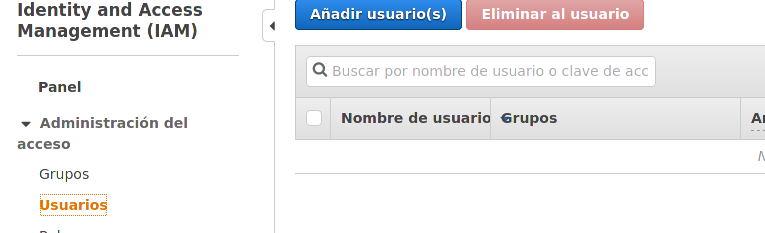
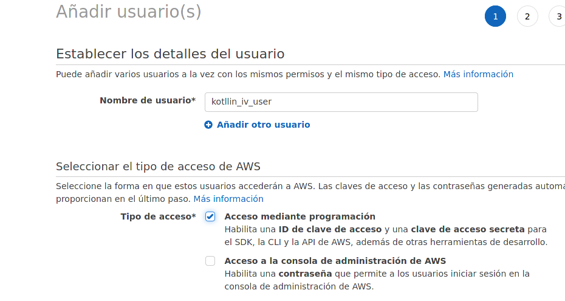
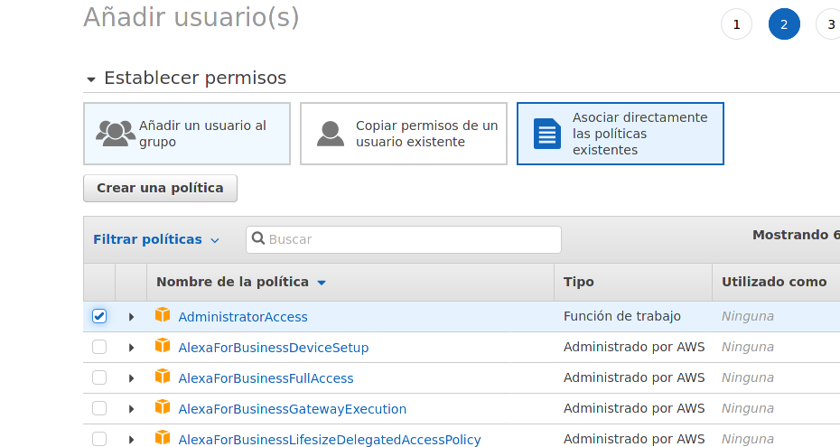
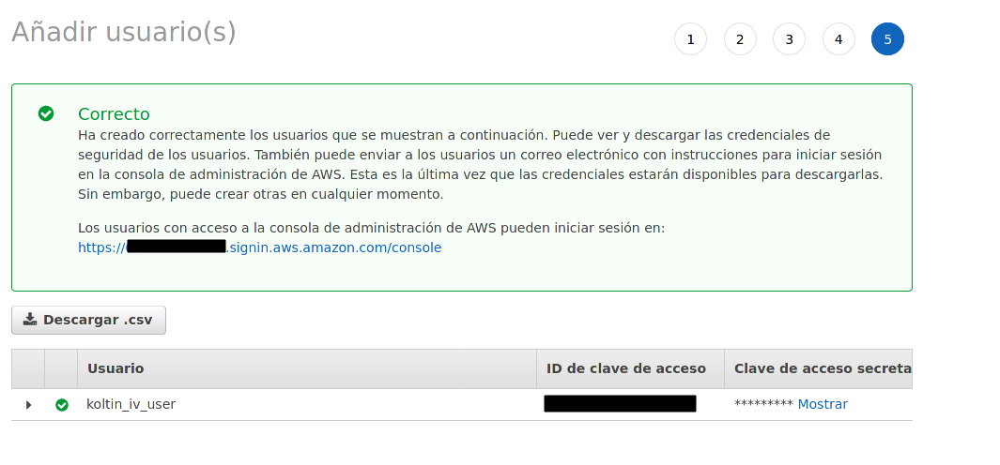
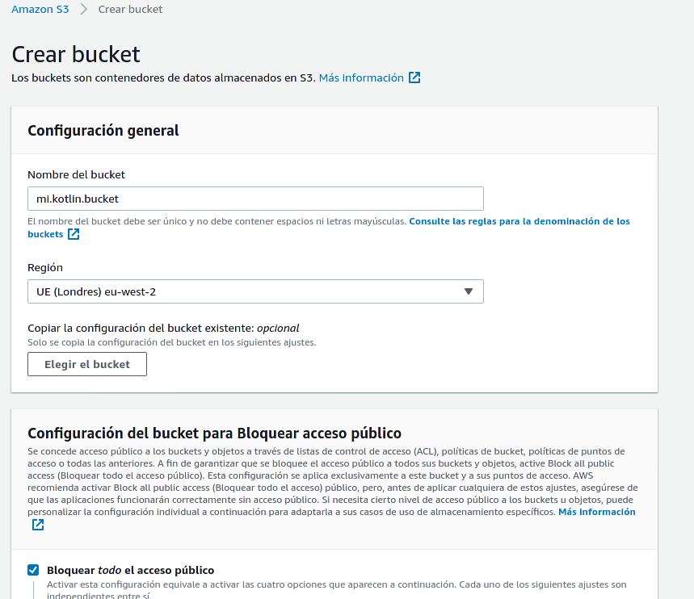
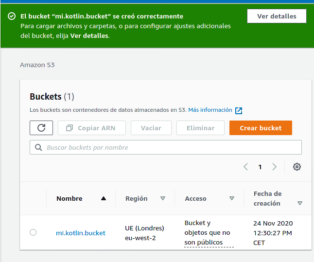
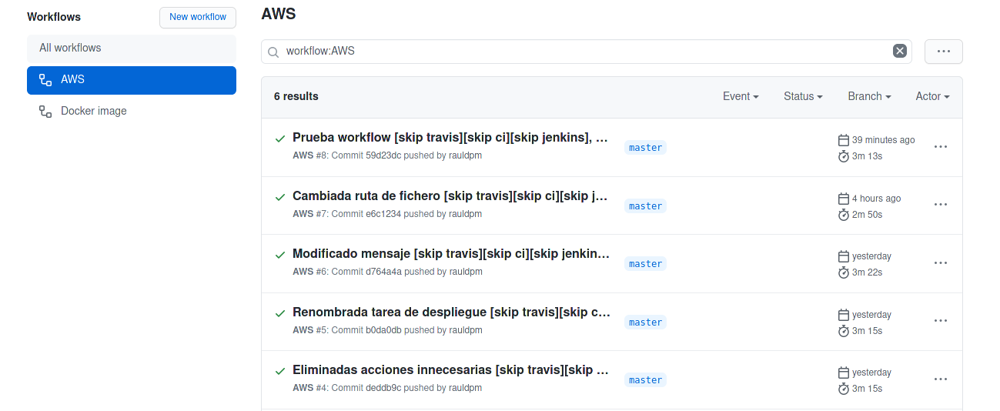
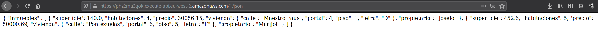

## Despliegue correcto y funcionando, con documentación de la conexión entre el repo en GitHub y Netlify/Vercel para despliegue continuo.

---
Debido a que el proyecto lo estoy haciendo en Kotlin con Gradle DSL, he encontrado muchas incompatibilidades  para escribir funciones serverless, ¿que se puede? si, se puede, pero requiere instalar un plugin en gradle (como [kotless](https://github.com/JetBrains/kotless), oficial de JetBrains).

El principal problema que me he encontrado es que la mayoría de las configuraciones requieren  modificar el taskrunner de Gradle, creando incompatibilidades entre ellos o que requieren de determinadas herramientas como kubernetes (como se ve en esta [página](https://kotlinexpertise.com/serverless-kotlin/)) que lo hace muy complicado ya que no siempre están actualizado (en ese enlace faltan datos y k3sup ha cambiado).

También me he encontrado que sitios serverless como Firebase, sí que permite el uso de kotlin pero en su version Android, cosa en la que este proyecto no esta enfocado (problema de librerías).

Asi he decidido usar el plugin de kotless ya que es el oficial y que me ha permitido realizar un despliegue en AWS (desgraciadamente solo permite el despliegue aquí como se indica en su pagina).

Para realizar esto primero he tenido que registrarme indicando una tarjeta de débito/crédito (por si se sobrepasa lo gratuito) 
 
El primer paso ha sido crear un par de funciones serverless, para ello, he creado un fichero [function_aws.kt](../../../app/src/main/kotlin/function_aws.kt) el cual contiene el import del plugin kotless y las funciones serverless, que en este caso devuelve un string y un json.

Después de indicar la ruta en la que se sirve solamente hay que crear una función de la forma que se ve en el fichero.

Para indicar la ruta en la que se va a servir la función, kotless proporciona una forma muy sencilla de hacerlo, y es mediante la forma **@Get("/")** y **@Get("/json")**, donde en las comillas se indica la ruta en la que se servirá, en este caso, en la raíz y /json.

**Aunque existe un programa AWSeducate, este no contempla el uso de funciones serverless**

Ahora viene la parte donde se configura AWS, esto consta de varios pasos:

1. Creación de un usuario IAM

2. Creación de un bucket S3
   

Una vez creado el usuario y el bucket, he tenido que configurar en el taskrunner [build.gradle.kts](../../../app/build.gradle.kts):
- El plugin kotless
- El repositorio jcenter()
- Las dependencias
  - kotlin(stdlin)
  - io.kotless

También he tenido que indicar la configuración de kotless en tres apartados:

1. La configuración, que indica el bucket s3 y el usuario (utiliza por debajo terraform)
2. El webapp para indicar el paquete
3. Una extension mediante la cual puedo emular el despliegue tanto el local (false) como en aws (true), de esta forma evito pasarme del limite de despliegues.

También he configurado un workflow de github actions llamado [aws.yml](../../../.github/workflows/aws.yml) mediante el cual realiza el despliegue desde github cuando hay una modificación en el fichero con la función serverless (para que desplegar todo si solo va a usar dicha función).

Este workflow realiza la descarga del repositorio, se autentifica mediante una aws-actions con las credenciales almacenadas en los secretos de GitHub, se identifica en AWS y realiza el despliegue.

Dicho despliegue lo hace mediante el comando del taskrunner "gradle deploy", que es una tarea que añade el plugin "kotless" (hay que darse cuenta como se nota que dicho plugin es oficial, ya que modifica el taskrunner internamente)

Como se puede ver en la siguiente imagen, el despliegue se hace correctamente:

El resultado del despliegue se puede observar en la dirección web [https://phz2ma3gok.execute-api.eu-west-2.amazonaws.com/1](https://phz2ma3gok.execute-api.eu-west-2.amazonaws.com/1), que muestra un mensaje simple.

Y en la dirección web [https://phz2ma3gok.execute-api.eu-west-2.amazonaws.com/1/json](https://phz2ma3gok.execute-api.eu-west-2.amazonaws.com/1/json) que muestra una cadena json, que es la que se compara con el fichero [5.json](../../../5.json).

