## Rubrica 2

### Descripción correcta de la configuración para despliegue automático, desde el repositorio o desde el sistema de integración continua

---

### Indice

1. [Introducción](#id1)
2. [Despliegue de un Jar mediante Taskrunner](#id2)
3. [Despliegue de un contenedor mediante GH Actions](#id3)
4. [Problemas con el despliegue de un contenedor en Heroku con Gradle](#id4)
5. [Prueba en local](#id5)

---

### 1. Introducción <a id="id1"></a>

El primer paso que hay que realizar es crear una aplicación en Heroku. Esto se puede realizar desde el dashboard de Heroku pulsado el botón de New -> Create new app.

En la pantalla que aparecerá se introduce el nombre de la App y la region.

También es posible hacerlo mediante el comando:

```
heroku apps:create --region eu inmobiliv
```

Ahora que ya se tiene creada la aplicación, solo quedaría desplegar. Para esto he implementado dos opciones:

- Despliegue desde el taskrunner de un Jar con la api
- Despliegue automático de un contenedor desde una GH Actions.

Aunque el propósito del hito es utilizar el taskrunner en un contenedor, en la propia documentación de Heroku, del framework usado Ktor, como por internet, el despliegue generalmente se hace de un Jar, ya que como he podido comprobar al hacer los ejercicios de la autoevaluacion, el despliegue se hace rápido al no depender de la inicializacion del taskrunner.

Asi, primero voy a explicar como he realizado un despliegue de un Jar y después explicare el despliegue mediante un contenedor y GH Actions.

**La configuración que se va a mostrar a continuación es de carácter explicativo y esta implementada en el proyecto como ejemplo de uso.**

---

### 2. Despliegue de un Jar mediante Taskrunner <a id="id2"></a>

El primer paso ha sido añadir al taskrunner un plugin para poder generar un fichero Jar. Esto lo he hecho mediante el plugin shadowJar, añadiendo lo siguiente en el fichero [build.gradle.kts](../../../app/build.gradle.kts)

```
import com.github.jengelman.gradle.plugins.shadow.tasks.ShadowJar

plugins {
    ...
    id("com.github.johnrengelman.shadow") version "6.1.0"
    ...
}
application {
    mainClassName = "com.inmobiliv.MainKt"
}
```

Ademas de dos tareas para crear el Manifest del archivo Jar con la clase principal y renombrar el nombre del Jar por defecto

```
tasks.jar {
    manifest {
        attributes (
            "Main-Class" to "com.inmobiliv.MainKt"
        )
    }
}

tasks.withType<ShadowJar>{ 
    archiveFileName.set("app.jar")
}

```

Ahora, al realizar la tarea "build", se creara el fichero app.jar de la aplicación en "app/build/libs/".

Para lanzar el servidor en local, bastaría con ejecutar la orden:

```
java -jar app/build/libs/app.jar
```

Sirviéndose en la dirección "0.0.0.0:23567".

El siguiente paso seria su despliegue, para esto he añadido otro [plugin especifico para Heroku](https://plugins.gradle.org/plugin/com.heroku.sdk.heroku-gradle), por lo que al fichero habria que añadirle lo siguiente:

```
plugins {
    ...
    id("com.heroku.sdk.heroku-gradle") version "2.0.0" 
    ...
}
```

Adicionalmente hace falta configurar el plugin indicando donde se despliega, que seria la siguiente:

```
heroku {
    setAppName("inmobiliv") // Especifica la app de heroku
    setIncludeBuildDir(false) // No incluye archivos innecesarios
    setJdkVersion("8") // Establece version JDK 
    var list = listOf<String>("app/build/libs/app.jar")
    setIncludes(list) // Incluye el fichero Jar a incluir
}
```

Ahora, mediante la ejecución del comando "gradle build deployHeroku" se realizara el despliegue, pero si se hiciera esto no funcionaria, ya que no sabría como ejecutarlo.

Para ello, hay que crear un fichero Procfile con el siguiente contenido:

```
web: app/build/libs/app.jar
```

Ahora, al realizar la tarea de despliegue se vería lo siguiente:

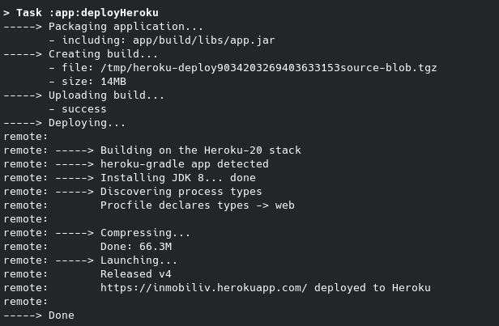

Como se puede ver, se esta desplegando el fichero .jar y esta detectando el fichero Procfile con la orden a ejecutar.

Si se mira el log de Heroku, se vera lo siguiente:

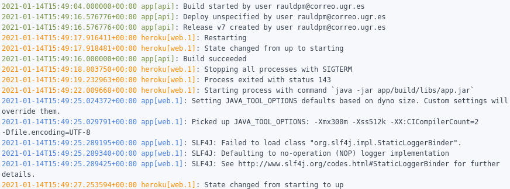

Donde se puede ver que no ha habido problema y que el estado es UP.

Si se navega a la dirección de la app, en el recurso /status, se puede ver que funciona:

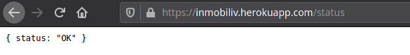

Ademas, he implementado un github action que realize esta tarea automáticamente desde el repositorio, se puede ver en el fichero [heroku_jar.yml](../../../.github/workflows/heroku_jar.yml)

Se puede ver como no realiza el despliegue en caso de que no pase los test:

El log se puede ver [aquí](https://github.com/rauldpm/InmobilIV/runs/1687653686?check_suite_focus=true)

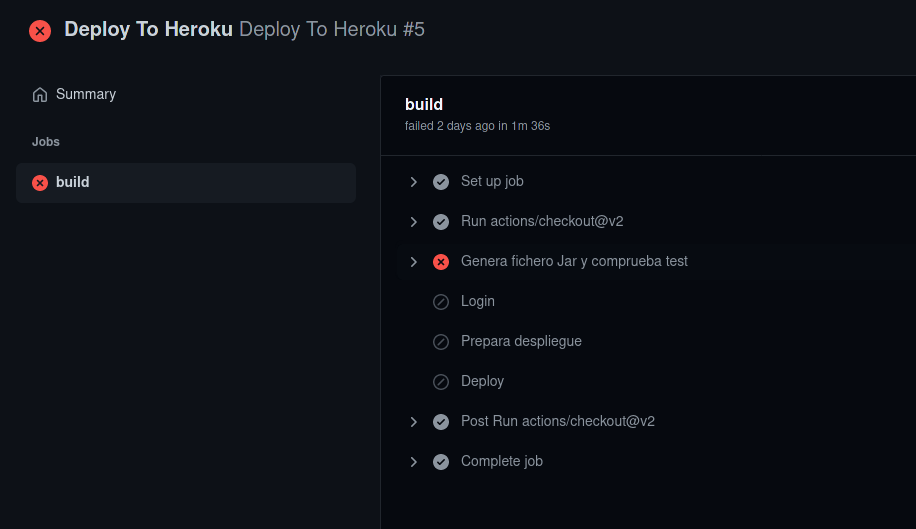

Como se puede ver en este [enlace](https://github.com/rauldpm/InmobilIV/runs/1688822411?check_suite_focus=true), el despliegue se hizo correctamente. En dicho enlace el fichero action se llama "heroku.yml" y no "heroku_jar.yml" puesto que fue modificado para despliegue con contenedor y se implemento en el fichero "heroku_jar.yml".

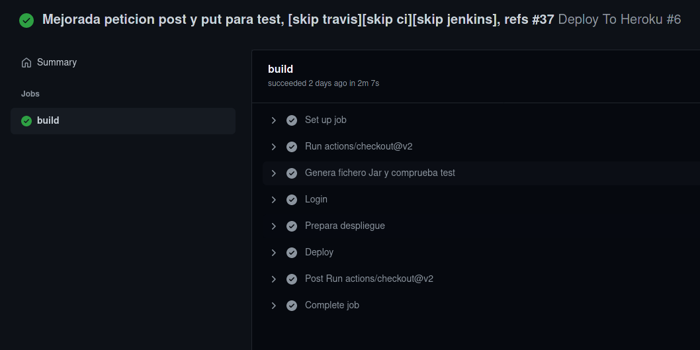

Y su log [aquí](https://github.com/rauldpm/InmobilIV/runs/1687825686?check_suite_focus=true)

Este workflow de heroku_jar.yml no se lanza bajo ningún concepto (se excluye la rama principal master) ya que esta solamente como ejemplo de funcionamiento.

---

### 3. [Despliegue de un contenedor mediante GH Actions](#id3) <a id="id3"></a>

Para este punto, ya no se utiliza el plugin shadowJar ni heroku-gradle, pero he decidido mantenerlo como implementación adicional.

Primero, he modificado la github action de forma que antes de realizar el despliegue, realiza los test, asi si falla el despliegue no se realiza.

Acto seguido y puesto que la acción para lanzar el servidor (gradle start) solo necesita los ficheros compilados, he generado dichos ficheros para evitar su generación en Heroku y acelerar el proceso.

Finalmente, me identifico en Heroku container mediante la API KEY de Heroku almacenada en secrets de GH, y utilizo el comando de heroku para realizar el push de la imagen y su release.

```
heroku container:login
heroku container:push web --recursive --app inmobiliv
heroku container:release web --app inmobiliv  
```

Nótese que la orden push, lleva el argumento "--recursive", esto se debe a que he tenido que crear otro Dockerfile especifico para este contenedor llamado "Dockerfile.web" del que hablare dentro de poco.

Como cada una de estas ordenes realiza una tarea diferente, están separadas en acciones, por lo que cada vez que se ejecuta una acción, hay que definir una variable de entorno con el secreto de la API KEY.

```
env:
    HEROKU_API_KEY: ${{secrets.HEROKU_API_KEY}}
```

Todo esto se puede observar en el fichero [heroku.yml](../../../.github/workflows/heroku.yml).

Para poder realizar este despliegue, es necesario crear un contenedor diferente al que se ha usado en otros hitos, ya que dicho contenedor realiza la ejecución de los test.

Para esto he creado un nuevo Dockerfile llamado "[Dockerfile.web](../../../Dockerfile.web)".

Este nuevo fichero realiza las mismas acciones principales que el primero, solo que ahora no monta carpeta, puesto que para mejorar el rendimiento del despliegue en Heroku, he realizado la copia de los ficheros principales de configuración y del código, junto a los ficheros compilados (se generan previamente en el GH action).

Si no se usara "--recursive" en la orden de heroku push, utilizaría por defecto el fichero Dockerfile (para test). Por esto, como estoy usando Dockerfile para una tarea especifica, he decidido renombrar el Dockerfile de test a Dockerfile.test, de forma que tendría estos dos ficheros:

- [Dockerfile.test](../../../Dockerfile.test) --> Realiza los test en un contenedor
- [Dockerfile.web](../../../Dockerfile.web) --> Lanza el servidor en un contenedor

En el caso de que se quiera lanzar el contenedor web en local haría falta indicar el puerto a usar en la misma orden, esto en Heroku no es necesario, ya que en la función main que lanza el servidor del fichero [Main.kt](../../../app/src/main/kotlin/Main.kt), se indica el puerto mediante:

```
val port = System.getenv("PORT")?.toInt() ?: 23567
```

Esto se debe a que Heroku tiene su propia variable de entorno PORT, al cual asigna un puerto aleatorio y en caso de que no encuentre dicha variable (como en local), utiliza el puerto 23567.

Volviendo al tema de contenedor, al haber renombrado el fichero Dockerfile a Dockerfile.test, hay que cambiar en Docker Hub el Dockerfile por defecto, ya que de otra forma no lo encontraría y fallaría:

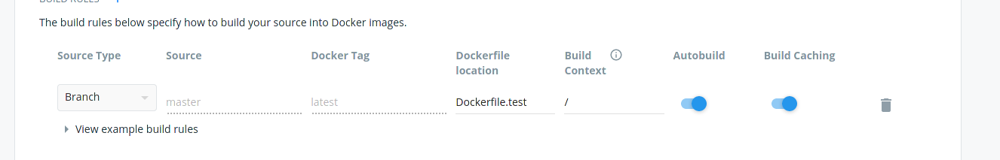

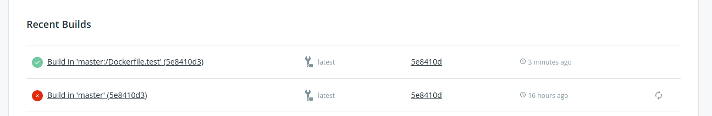

Como se puede ver en la segunda imagen, al realizar el build se especifica Dockerfile.test.

Al ser un despliegue de un contenedor docker, no es necesario la utilización de un fichero de configuración "heroku.yml" ni de un fichero "Procfile", como si lo hacia en el despliegue de un Jar.

Esto se debe a que la ejecución se realiza según lo especificado en el CMD del Dockerfile.web.

Esta orden es "gradle start" y es una tarea implementada en el fichero taskrunner que lanza la tarea "run" (en gradle por defecto la orden seria "gradle run", pero para seguir el guion del hito he creado este "alias")

Asi, al realizar un push en el repositorio de GitHub se lanzara el workflow de "heroku.yml" como se puede ver en la siguiente imagen:

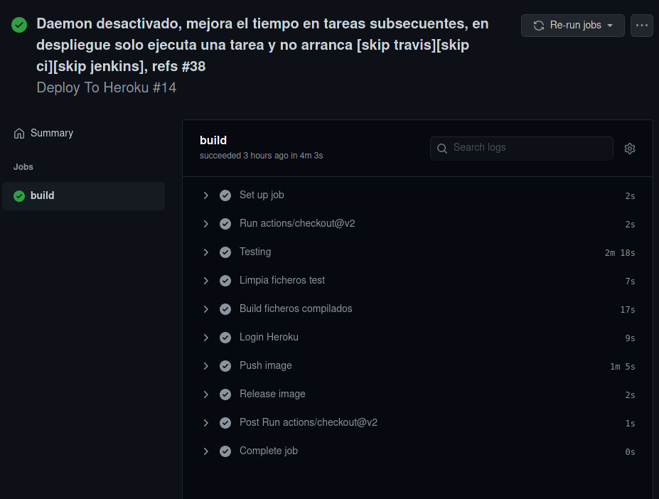

Y su log [aquí](https://github.com/rauldpm/InmobilIV/runs/1702219601?check_suite_focus=true).

En Heroku se iniciara el contenedor con la orden "gradle start" y (después de un tiempo) iniciara el servidor, permitiendo hacer peticiones http y visitar sus recursos.

En el log de heroku, observado mediante el comando:

```
heroku logs --tail --app inmobliv
```

Se puede observar como consigue un estado UP:

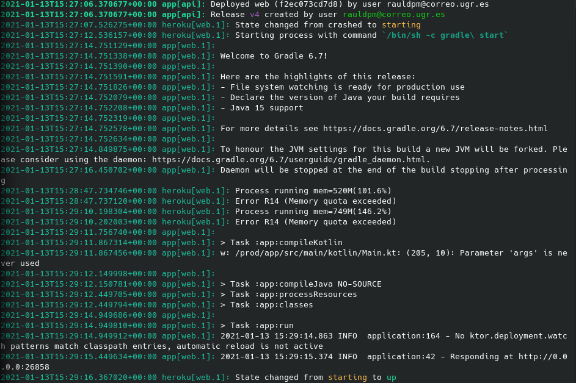

Se pueden ver errores de exceso de memoria de los cuales ya hablare mas tarde.

Y si se visita el recurso /inmuebles de la aplicación se vería lo siguiente:

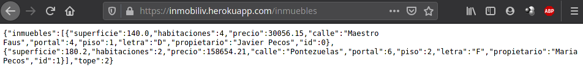

Asimismo, si se realiza una petición "GET" mediante curl a /inmuebles, se obtendría lo siguiente:

```
curl -X GET http://https://inmobiliv.herokuapp.com/inmuebles
```
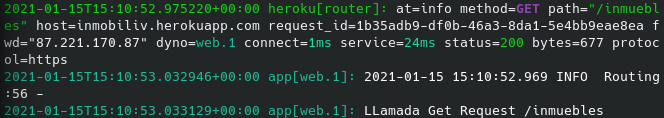

Haciendo una petición POST para crear un inmueble:

```
curl -X POST -F superficie=112.2 -F habitaciones=3 -F precio=12556.36 -F calle="Pedro Antonio" -F portal=3 -F piso=4 -F letra=F -F propietario="Javier Iañez" https://inmobiliv.herokuapp.com/inmuebles
```
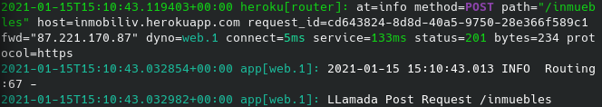

Se puede ver que el contenido ha cambiado visitando /inmuebles

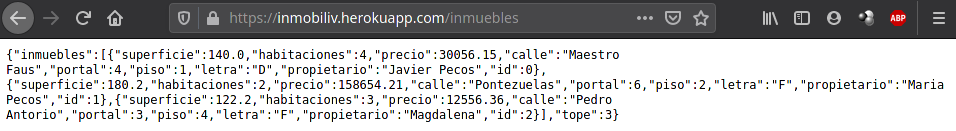

Si ahora se hace una petición PUT al elemento con identificado 0:

```
curl -X PUT -F superficie=112.2 -F habitaciones=3 -F precio=12556.36 -F calle="Pedro Antonio" -F portal=3 -F piso=4 -F letra=F -F propietario="Javier Iañez" https://inmobiliv.herokuapp.com/inmuebles/0
```
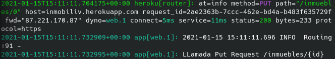

Se puede ver que el primer elemento ha cambiado por completo

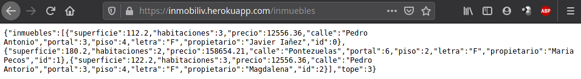

Y finalmente, haciendo una petición DELETE:

```
curl -X DELETE https://inmobiliv.herokuapp.com/inmuebles/0
```
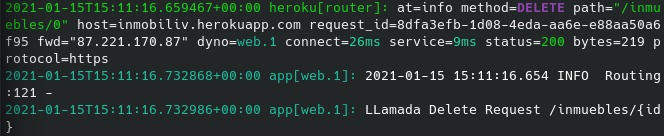

Se puede ver como el elemento con identificador 0 ya no existe:

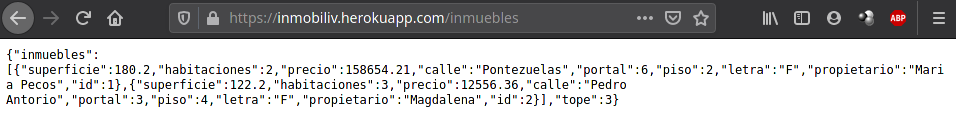

En estas imágenes se puede observar el log de Heroku, el cual muestra algunos mensajes de log de nuestra aplicación, identificados de color azul (app[web.1])


---

### 4. Problemas con el despliegue de un contenedor en Heroku con Gradle <a id="id4"></a>

Me he encontrado dos problemas durante el despliegue de un contenedor en Heroku, específicamente, durante la inicializacion del contenedor.

Estos problemas son:

- R10 - Boot timeout
- R14 - Memory Quota Exceded

Estos dos problemas se deben principalmente al demonio de Gradle, ya he explicado en otros hitos que Gradle dispone de un demonio para gestionar la estructura del proyecto y sus tareas, de forma que se ejecuten con mas rapidez.

El problema principal es que este demonio no se puede desactivar por completo, si se desactiva, lo que hace es terminar el demonio al terminar la tarea, nada mas.

Esto en local no supone problema, ya que la tarea que mas me ha tardado ha sido 19s (compileKotlin).

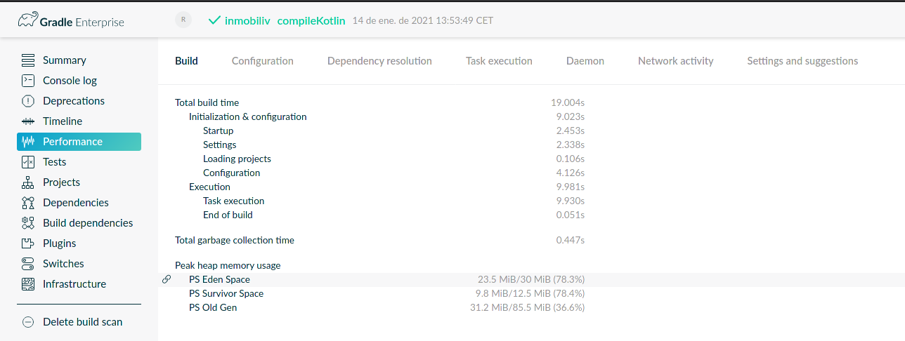

El problema viene en la ejecución dentro de un contenedor, que debido a la limitación del mismo, dicha ejecución pasa a ser mucho mayor.

Puesto que la tarea "gradle start" solo depende de la subtarea "compileKotlin", he generado dichos archivos previamente para asi evitar que los genere.

Esto en local si he visto que ha mejorado puesto que ha tardado algunos segundos menos, pero en el contenedor el problema ha persistido.

Asi, he descubierto que el principal problema es que el demonio tarda demasiado (solo el demonio, sin ejecutar tareas internas) y puesto que Heroku tiene un limite de 60" para establecer el puerto, termina la inicializacion con "crashed".

Esto he conseguido solucionarlo con la siguiente pagina:

- [https://tools.heroku.support/limits/boot_timeout](https://tools.heroku.support/limits/boot_timeout)

Aquí se puede seleccionar una app de Heroku y cambiarle el tiempo hasta un máximo de 180" (justo lo que necesita mi app)

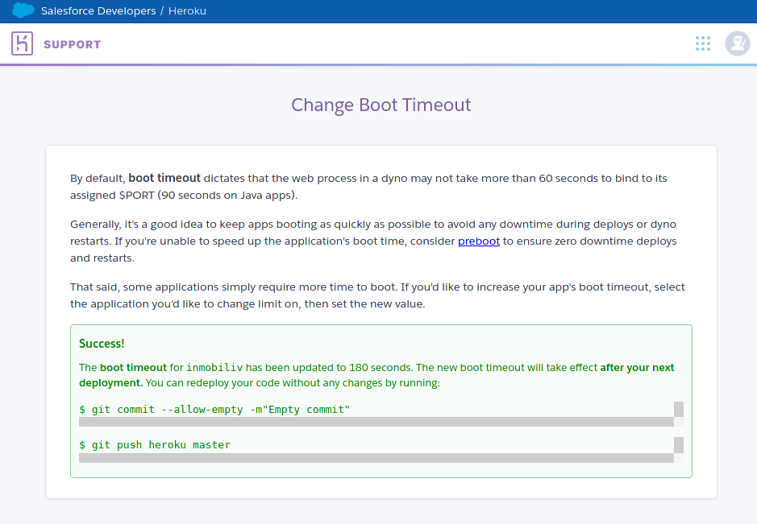

Aunque ahi diga que para Java Apps es de 90", no es asi en este caso, ya que con Java Apps se esta refiriendo a aplicaciones que usan .jar, en este caso, es un contenedor.

Respecto al error R14, es un problema de memoria del contenedor, yo puedo configurar la memoria que va a usar mi app dentro del contenedor, pero no la máxima memoria que va a usar el contenedor, que incluye otros procesos de la imagen del mismo.

Esto lo he intentado solucionar mediante docker-compose, que permite limitar la memoria del contenedor pero docker-compose no es reconocido por Heroku. En la documentación solo hace referencia para pruebas locales.

Asi, como sustitución de docker-compose se utiliza un fichero de configuración llamado heroku.yml, pero no he encontrado la forma de limitar la memoria en este fichero.

Ademas, Heroku detecta que el contenedor ejecuta Gradle y lo establece automáticamente en su buildpack:

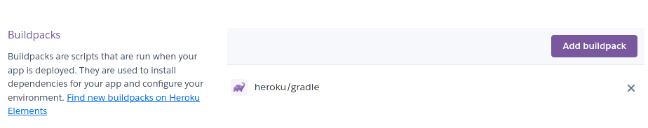

Esto permite que el fichero de configuración heroku.yml no sea necesario ni el fichero Procfile para el despliegue.

---

### 5. Prueba en local <a id="id5"></a>

Aunque el fichero Procfile no sea necesario para el despliegue si lo es para probar en local antes del despliegue, para ello, su contenido tendrá que ser:

```
web: gradle start
```

Y al ejecutar:

```
heroku local web
```

Se lanzara el servidor:

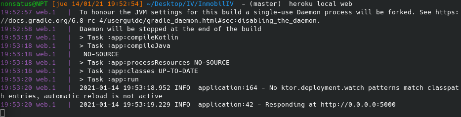

Si no existiera dicho Procfile, mostraría un error:

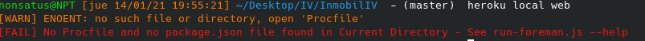